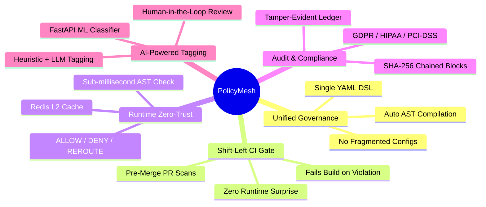
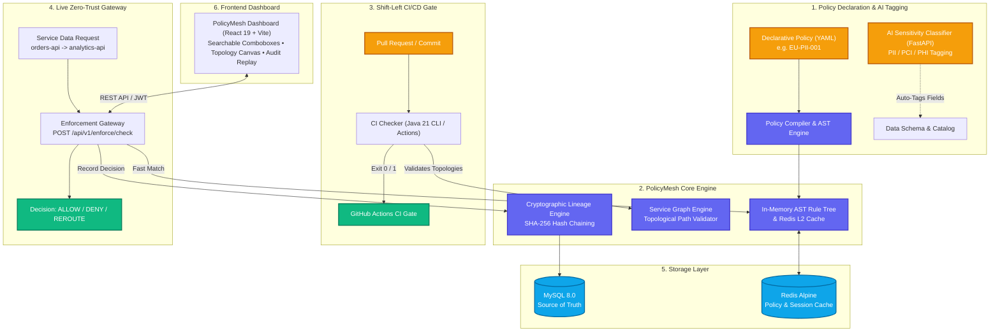
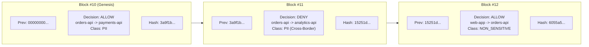

<div align="center">
  
  
  # PolicyMesh
  
  ### *Policy-as-Code Platform for Cross-Border Data Residency & Zero-Trust Governance*

  [](https://openjdk.org/projects/jdk/21/)
  [](https://spring.io/projects/spring-boot)
  [](https://react.dev/)
  [](https://vitejs.dev/)
  [](https://www.mysql.com/)
  [](https://redis.io/)
  [](https://fastapi.tiangolo.com/)
  [](https://www.docker.com/)
  [](LICENSE)

  <p align="center">
    <b>Declare once in YAML • Enforce in CI/CD & Runtime • Verify with Cryptographic SHA-256 Lineage</b>
  </p>
</div>

---

## 📌 Table of Contents

- [Overview](#-overview)
- [Why PolicyMesh?](#-why-policymesh)
- [System Architecture](#-system-architecture)
- [Dual-Lifecycle Enforcement Flow](#-dual-lifecycle-enforcement-flow)
- [Key Features](#-key-features)
- [Tech Stack](#-tech-stack)
- [Project Directory Structure](#-project-directory-structure)
- [Quick Start Guide](#-quick-start-guide)
  - [Option A: Full Docker Compose Launch (Recommended)](#option-a-full-docker-compose-launch-recommended)
  - [Option B: Local Hybrid Development](#option-b-local-hybrid-development)
- [Interactive Web UI Walkthrough](#-interactive-web-ui-walkthrough)
- [REST API Reference](#-rest-api-reference)
- [Standalone CI/CD Checker](#-standalone-cicd-checker)
- [Cryptographic Lineage Ledger](#-cryptographic-lineage-ledger)
- [Security & Compliance](#-security--compliance)
- [License](#-license)

---

## 📖 Overview

**PolicyMesh** is a comprehensive, production-grade **Policy-as-Code (PaC)** platform engineered for cross-border data residency, sovereign data isolation, and jurisdictional compliance (GDPR, HIPAA, DPDPA, PCI-DSS).

In modern microservice meshes, preventing sensitive data from illegally traversing geographical borders (e.g., transferring EU personal customer records to unauthorized US or third-party servers) is notoriously difficult.

PolicyMesh solves this by unifying governance into a **single declarative YAML policy** compiled into Abstract Syntax Trees (AST) that enforce compliance across **two critical lifecycle stages**:

1. **Shift-Left CI/CD Pre-Merge Gate:** Automatically scans code and service topology pull requests to block disallowed data flow edges *before* deployment.
2. **Zero-Trust Runtime Enforcement Gateway:** Evaluates live microservice-to-microservice transfer requests with sub-millisecond AST evaluation, returning `ALLOW`, `DENY`, or `REROUTE`.
3. **Cryptographic Lineage Audit Ledger:** Every single decision is sealed in an immutable **SHA-256 hash-chained write-ahead ledger**, producing legally verifiable, tamper-evident compliance proof.

---

## 💡 Why PolicyMesh?



---

## 🏛️ System Architecture

PolicyMesh operates as a distributed, high-performance architecture connecting declarative policies, compiled engines, an AI classification service, and a responsive web dashboard.



---

## 🔄 Dual-Lifecycle Enforcement Flow

PolicyMesh guarantees that non-compliant data flows cannot enter production at build-time, while securing live communication at runtime.

```mermaid
sequenceDiagram
    autonumber
    actor Dev as Engineer / PR
    participant CI as CI Checker Gate
    participant Compiler as Policy AST Compiler
    participant Runtime as Runtime Gateway
    participant Ledger as SHA-256 Lineage Ledger
    participant DB as MySQL Database

    rect rgb(20, 25, 45)
        note over Dev,CI: Lifecycle Phase 1: Shift-Left CI/CD Gate (Pre-Merge)
        Dev->>CI: Push Commit / Open PR (e.g., EU Service -> US Service)
        CI->>Compiler: Parse YAML Policies & Compile AST
        CI->>CI: Build Proposed Service Topology Graph
        CI-->>Dev: ❌ ERROR: Violates Policy EU-PII-001 (Cross-Border Transfer Disallowed)
        note right of Dev: PR blocked from merging into main branch
    end

    rect rgb(25, 40, 30)
        note over Dev,DB: Lifecycle Phase 2: Zero-Trust Runtime Gateway (Live Traffic)
        actor SvcA as orders-api (EU)
        actor SvcB as payments-api (EU)
        SvcA->>Runtime: POST /api/v1/enforce/check (PII transfer)
        Runtime->>Compiler: Evaluate In-Memory AST Rules
        Runtime->>Ledger: Append Decision Block (Hash Chaining)
        Ledger->>DB: Store Lineage Record (PrevHash + CurrentHash + Timestamp)
        Runtime-->>SvcA: ✅ ALLOW (Decision #12 • Ledger Hash: 6055a5...)
        SvcA->>SvcB: Transfer Payload securely
    end
```



---

## ✨ Key Features

| Feature | Description |
|---|---|
| **🛡️ Declarative Policy DSL** | Express complex multi-jurisdiction data-residency rules concisely in standard YAML. Supports allowed/denied regions, classification constraints, and fallback routing. |
| **⚡ Sub-Millisecond AST Engine** | In-memory compiled Abstract Syntax Trees cached in Redis deliver ultra-low latency enforcement decisions for high-throughput service meshes. |
| **🚦 Pre-Merge CI/CD Gate** | Standalone Java 21 CLI scanner runs in GitHub Actions or locally without a database, preventing architectural compliance drift. |
| **🔗 Tamper-Evident Lineage** | Every policy decision is immutably appended to a cryptographic SHA-256 hash-chain with real-time verification (`/api/v1/lineage/verify`). |
| **🤖 AI Schema Classifier** | Python FastAPI microservice that utilizes heuristics and LLMs to automatically classify field sensitivities (`PII`, `PCI`, `PHI`) with human-in-the-loop review. |
| **🎨 Modern Glassmorphism UI** | React 19 + Vite frontend with clean searchable comboboxes, interactive data flow graph visualizer, and live decision auditor. |
| **🔐 Enterprise RBAC & Security** | JWT authentication, BCrypt hashing, rate-limiting, and 4 granular roles: `ADMIN`, `COMPLIANCE_OFFICER`, `ENGINEER`, `VIEWER`. |
| **💾 State Persistence & URL Sync** | Client-side debounced form draft preservation (`sessionStorage`) and bidirectional URL parameter syncing across navigation. |

---

## 💻 Tech Stack

| Layer | Technologies |
|---|---|
| **Backend Core** | Java 21 LTS · Spring Boot 3.2 · Spring Security (JWT) · Spring Data JPA · Flyway Migration |
| **Frontend Web** | React 19 · Vite 5 · Vanilla CSS / Tailwind Design Tokens · Lucide Icons · Axios |
| **Database & Cache** | MySQL 8.0 (InnoDB, utf8mb4) · Redis Alpine (Policy & Session Caching) |
| **AI Classification** | Python 3.11+ · FastAPI · Uvicorn · Heuristic Regex + Remote LLM Provider |
| **CI/CD & CLI** | Java 21 Standalone CLI · Maven 3.9 · GitHub Actions Matrix CI |
| **Containerization** | Docker Engine · Multi-Stage Dockerfile · Docker Compose v2 |

---

## 📁 Project Directory Structure

```text
PolicyMesh/
├── backend/                     # Spring Boot 3.2 REST API & Enforcement Engine
│   ├── src/main/java/com/policymesh/
│   │   ├── ai/                  # AI Client integration & review workflow
│   │   ├── audit/               # Audit logger & decision controllers
│   │   ├── auth/                # JWT Auth, User entity, RBAC security config
│   │   ├── ci/                  # CI scan persistence & GitHub Actions API
│   │   ├── common/              # Global error handling & ProblemDetail DTOs
│   │   ├── dev/                 # Demo environment seeder
│   │   ├── enforcement/         # Runtime policy evaluation gateway
│   │   ├── graph/               # Service graph & data flow topology engine
│   │   ├── lineage/             # SHA-256 hash-chaining cryptographic ledger
│   │   ├── policy/              # YAML parser, compiler, AST representation
│   │   ├── reports/             # Compliance reporting & CSV exports
│   │   ├── service/             # Service node registry
│   │   └── settings/            # System configuration & health metrics
│   └── src/main/resources/db/migration/  # Flyway schema migrations (V1__init_schema.sql)
│
├── frontend/                    # React 19 + Vite modern dark-theme dashboard
│   ├── public/                  # Static assets, logo.png, favicon.png
│   └── src/
│       ├── api/                 # Axios HTTP client with JWT interceptor
│       ├── components/          # Reusable UI, Topbar, Sidebar, SearchableCombobox
│       ├── context/             # AuthContext (JWT & session lifecycle)
│       ├── hooks/               # useFormDraft, useQueryState
│       └── pages/               # Dashboard, RuntimeMonitor, Lineage, CiCheck, etc.
│
├── ai-service/                  # Python FastAPI AI schema classifier
│   └── app/                     # Field sensitivity heuristics & LLM classifier
│
├── ci-checker/                  # Standalone Java 21 CLI scanner for CI/CD gates
│   └── src/main/java/com/policymesh/ci/
│
├── policies/                    # Declarative YAML policies (EU, US, IN, GLOBAL)
├── examples/                    # Sample service registries & data flow topologies
├── infrastructure/              # Docker Compose definitions, configs & env templates
└── docs/                        # Complete technical specs & architecture blueprints
```

---

## 🚀 Quick Start Guide

### Option A: Full Docker Compose Launch (Recommended)

Start the entire PolicyMesh ecosystem (MySQL + Redis + Backend + Frontend + AI Service) with a single command:

```bash
# 1. Clone the repository
git clone https://github.com/VishalRajExe/PolicyMesh.git
cd PolicyMesh

# 2. Configure environment
cp infrastructure/env/.env.example infrastructure/compose/.env

# 3. Launch all services via Docker Compose
cd infrastructure/compose
docker compose --env-file .env up -d
```

#### Access PolicyMesh:
- **Frontend Dashboard:** [http://localhost:5173](http://localhost:5173)
- **Backend REST API:** [http://localhost:8080](http://localhost:8080)
- **AI Classification API:** [http://localhost:8000/docs](http://localhost:8000/docs)
- **Actuator Health:** [http://localhost:8080/actuator/health](http://localhost:8080/actuator/health)

---

### Option B: Local Hybrid Development

#### 1. Start Infrastructure (MySQL + Redis)
```bash
cd infrastructure/compose
docker compose up -d mysql redis
```

#### 2. Run Backend API (Java 21)
```bash
cd backend
$env:DB_USERNAME="root"
$env:DB_PASSWORD="admin"
$env:DB_NAME="policymeshdb"
mvn spring-boot:run
```

#### 3. Run AI Classification Service (Python 3.11+)
```bash
cd ai-service
pip install -r requirements.txt
python -m uvicorn app.main:app --host 127.0.0.1 --port 8000 --reload
```

#### 4. Run Frontend Dashboard (Node.js 18+)
```bash
cd frontend
npm install
npm run dev
```

---

## 🖥️ Interactive Web UI Walkthrough

| View | Capabilities |
|---|---|
| **📊 Executive Dashboard** | Real-time compliance health score, active violations count, 24-hour decision trends, and topology overview. |
| **⚡ Runtime Monitor** | Live zero-trust policy enforcement sandbox. Select services via **Searchable Comboboxes** and execute live evaluations. |
| **🌐 Service Graph & Flows** | Interactive topological graph mapping cross-service pipelines and jurisdictional boundaries. |
| **📜 Policy Manager** | Create, edit, activate, or archive declarative data-residency YAML rules. |
| **🔗 Lineage Explorer** | Inspect cryptographic SHA-256 hash blocks, parent hashes, decision timestamps, and verify ledger integrity with 1 click. |
| **🤖 AI Schema Classifier** | Automated sensitivity tagging (`PII`, `PCI`, `PHI`) for enterprise database fields with human review workflows. |
| **🚦 CI/CD Gate Portal** | On-demand scan triggering for Git branches and commit hashes with violation diffs. |

---

## 📡 REST API Reference

Base URL: `http://localhost:8080/api/v1`  
*All endpoints (except `/auth/*`) require a valid `Authorization: Bearer <token>` header.*

```text
Authentication
├── POST   /auth/register           # Register new user account
└── POST   /auth/login              # Authenticate & issue JWT

Policy Management
├── GET    /policies                # List all policies (supports filters)
├── POST   /policies                # Create new policy rule
├── GET    /policies/{id}           # Retrieve policy details
├── PUT    /policies/{id}           # Update policy
└── DELETE /policies/{id}           # Delete policy

Services & Data Flows
├── GET    /services                # List registered microservices
├── POST   /services                # Register new service node
├── GET    /edges                   # List registered data flow edges
├── POST   /edges                   # Create new data flow edge
├── GET    /graph                   # Fetch full topology graph
└── POST   /graph/validate          # Validate graph against active policies

Zero-Trust Enforcement & Lineage
├── POST   /enforce/check           # Evaluate live transfer (ALLOW / DENY)
├── GET    /lineage                 # Query cryptographic audit records
├── GET    /lineage/{id}            # Get single lineage block
└── GET    /lineage/verify          # Verify hash-chain cryptographic integrity

CI/CD Compliance Gate
├── POST   /ci/check                # Execute pre-merge compliance scan
└── GET    /ci/scans/{id}           # Get past scan results & violations

AI Schema Sensitivity
├── POST   /ai/classify             # Auto-classify field sensitivity
├── POST   /ai/classify/{id}/approve# Human-in-the-loop approval
└── POST   /ai/classify/{id}/reject # Human-in-the-loop rejection

Audit, Users & Reports
├── GET    /audit/decisions         # Recent 100 enforcement decisions
├── GET    /users                   # User management (ADMIN only)
├── GET    /reports/summary         # Governance audit summary
└── GET    /reports/export          # Download audit report CSV
```

---

## 🔍 Standalone CI/CD Checker

The PolicyMesh CI Checker runs as a lightweight, **database-free** validation binary inside any continuous integration pipeline:

```bash
# Run standalone checker against policies and service topology
java -jar ci-checker/target/ci-checker-1.0.0.jar \
  --policies policies/EU \
  --services examples/services/services.json \
  --dataflows examples/dataflows/cross-border-flow.json

# Exit Codes:
#   0 = PASS (100% Compliant)
#   1 = VIOLATION (Blocked by Policy)
#   2 = ERROR (Malformed input / missing files)
```

---

## 🔐 Cryptographic Lineage Ledger

PolicyMesh incorporates a tamper-evident **write-ahead lineage ledger** modeled after blockchain cryptographic primitives:



- Each block computes `SHA-256(previousHash + decisionId + source + destination + dataClass + decision + timestamp)`.
- If an attacker modifies any historic decision in the database, the cryptographic chain breaks immediately and is flagged by `/api/v1/lineage/verify`.

---

## 🔒 Security & Compliance

- **Zero-Trust Network Model:** Explicit authorization is required for every cross-region transfer.
- **Role-Based Access Control (RBAC):** Principle of least privilege enforced on every endpoint.
- **Robust Input Validation:** Strict regex and format validation prevents SQL injection and header tampering.
- **No Hardcoded Secrets:** Dynamic environment variables with zero plaintext credentials in git history.
- **Production Hardened:** 100% automated test suite coverage (`60/60` passing unit and integration tests).

---

## 📄 License

Distributed under the **MIT License**. See [`LICENSE`](LICENSE) for more information.

<div align="center">
  <sub>Built with ❤️ for <b>DoraHacks 2.0</b> • PolicyMesh Engineering Team</sub>
</div>
