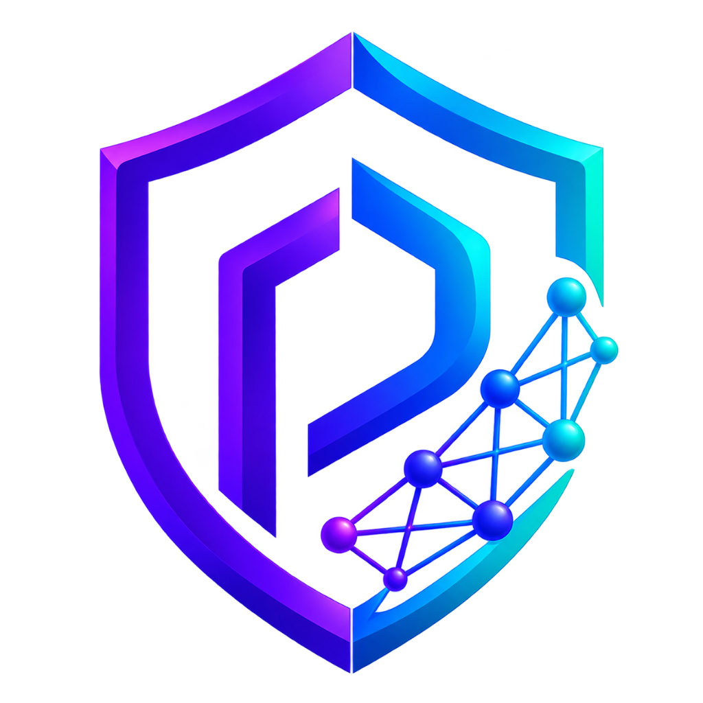
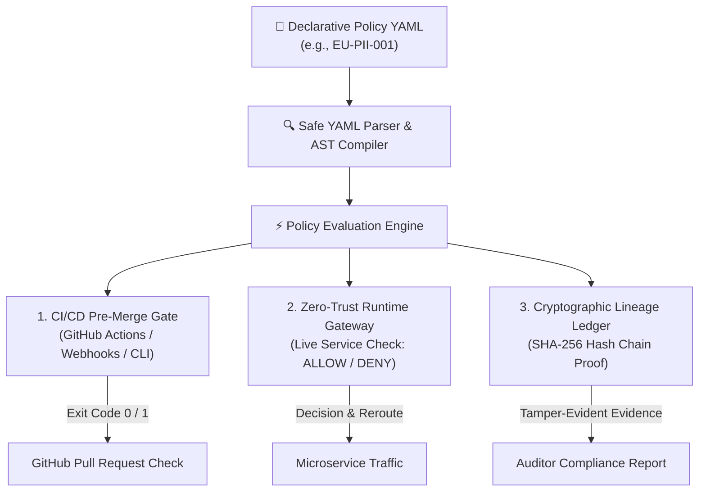
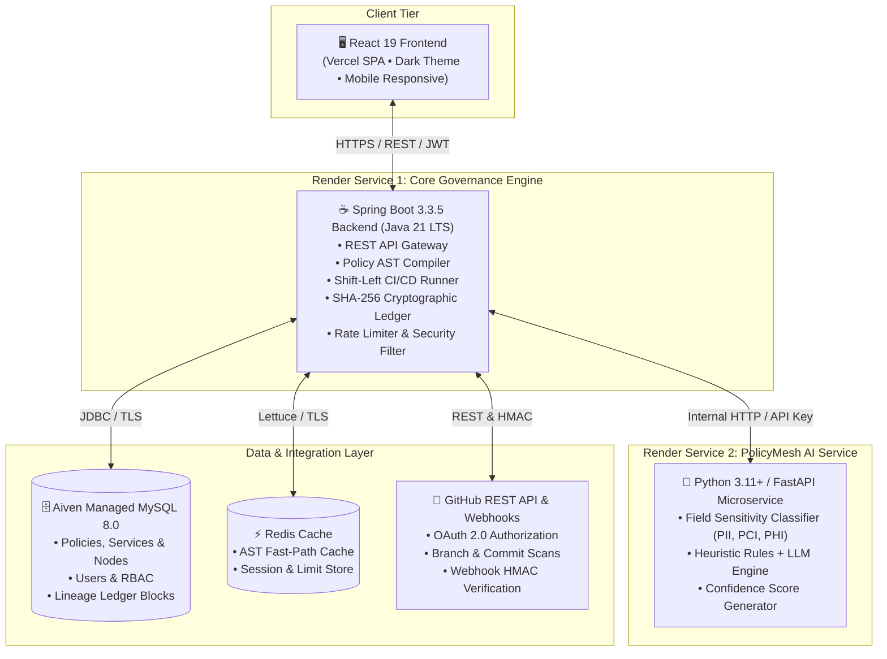
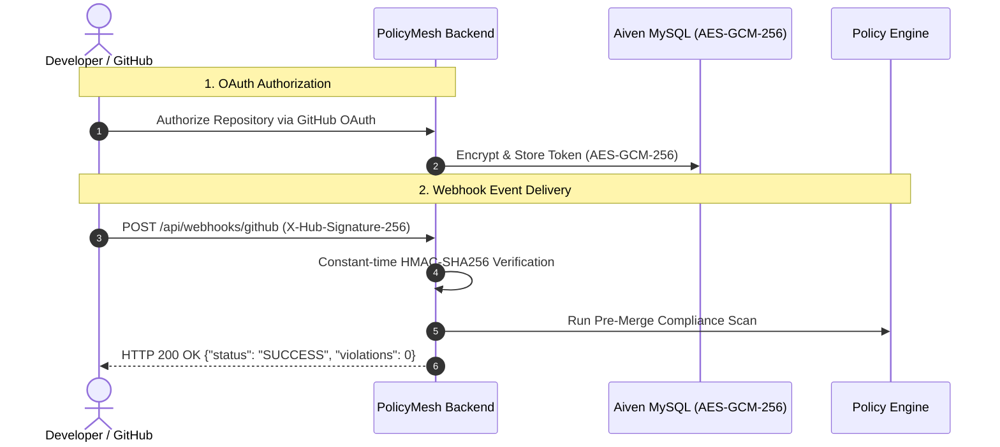
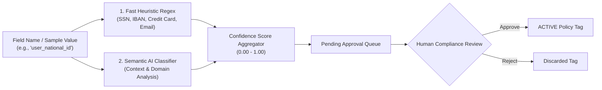
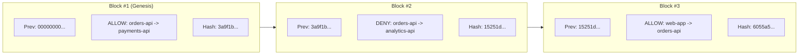

<div align="center">
  

  # PolicyMesh

  ### *Policy-as-Code Platform for Cross-Border Data Residency, Zero-Trust Runtime Governance & CI/CD Guardrails*

  **Govern. Enforce. Trust.**

  [](https://openjdk.org/projects/jdk/21/)
  [](https://spring.io/projects/spring-boot)
  [](https://react.dev/)
  [](https://vitejs.dev/)
  [](https://fastapi.tiangolo.com/)
  [-blue.svg?logo=mysql&logoColor=white)](https://www.mysql.com/)
  [](https://github.com/VishalRajExe/PolicyMesh)
  [](https://github.com/VishalRajExe/PolicyMesh)
  [](LICENSE)

  <p align="center">
    <a href="https://policy-mesh.vercel.app"><b>🌐 Live Web App</b></a> •
    <a href="https://policymesh-komp.onrender.com/health"><b>⚡ Public Health Endpoint</b></a> •
    <a href="#-rest-api-reference"><b>📡 API Reference</b></a> •
    <a href="#-quick-start-guide"><b>🚀 Quick Start</b></a>
  </p>
</div>

---

## 📌 Table of Contents

1. [What is PolicyMesh?](#1-what-is-policymesh)
2. [The Problem](#2-the-problem)
3. [The Solution](#3-the-solution)
4. [Why Policy-as-Code?](#4-why-policy-as-code)
5. [System Architecture](#5-system-architecture)
6. [Dual-Lifecycle Enforcement Flow](#6-dual-lifecycle-enforcement-flow)
7. [Core Features & Modules](#7-core-features--modules)
8. [GitHub Integration & Webhook Flow](#8-github-integration--webhook-flow)
9. [AI Sensitivity Classifier & Human-in-the-Loop Review](#9-ai-sensitivity-classifier--human-in-the-loop-review)
10. [Cryptographic Lineage Ledger](#10-cryptographic-lineage-ledger)
11. [Security Hardening & Penetration-Resistance](#11-security-hardening--penetration-resistance)
12. [Tech Stack](#12-tech-stack)
13. [Project Directory Structure](#13-project-directory-structure)
14. [Quick Start Guide](#14-quick-start-guide)
15. [Production Deployment Architecture](#15-production-deployment-architecture)
16. [REST API Reference](#16-rest-api-reference)
17. [Standalone CI/CD Checker CLI](#17-standalone-cicd-checker-cli)
18. [Roadmap](#18-roadmap)
19. [License & Credits](#19-license--credits)

---

## 1. What is PolicyMesh?

**PolicyMesh** is a modern **Policy-as-Code (PaC) data governance and residency enforcement platform**. It empowers organizations to declaratively define how sensitive customer records, financial transactions, and healthcare data move between microservices and across sovereign geographical regions.

```text
               EU Customer PII Data Transfer
               =============================

    orders-api [Region: EU]  ───▶  payments-api [Region: EU]
    ✅ ALLOWED (Within approved sovereign boundary)

    orders-api [Region: EU]  ───▶  analytics-api [Region: US]
    🚫 BLOCKED (Disallowed cross-border transfer under GDPR / EU-PII-001)
```

PolicyMesh compiles human-readable YAML residency rules into high-speed Abstract Syntax Trees (ASTs), continuously evaluating traffic both **before code merges** in CI/CD pipelines and **in real-time** across live service meshes.

---

## 2. The Problem

Modern cloud platforms span multiple cloud regions, third-party APIs, and distributed microservices. While a cross-service payload transfer might execute without a single technical error, it frequently creates severe legal violations:

- **Data Sovereignty & Residency Breaches:** Regulations like **GDPR** (EU), **DPDPA** (India), **HIPAA** (US), and **CCPA** strictly restrict where citizen data can be stored, transmitted, or analyzed.
- **Architectural Drift:** Engineers frequently add new microservice integrations or dependencies in code without realizing that a downstream database or caching layer resides in an unauthorized region.
- **Audit Deficits:** Traditional logging captures transaction IDs but lacks cryptographic, tamper-evident proof required by compliance auditors to demonstrate that policy enforcement was consistently applied.

---

## 3. The Solution

**Define once in YAML. Enforce everywhere across the lifecycle.**

PolicyMesh unifies governance across **Build**, **Runtime**, and **Audit**:



---

## 4. Why Policy-as-Code?

Treating data governance as code allows compliance teams and engineers to version, test, peer-review, and automate rules using Git workflows:

```yaml
policyCode: EU-PII-001
name: EU PII Data Residency & Sovereign Isolation
jurisdiction: EU
dataClass: PII
version: 1.0.0

allowedRegions:
  - EU
  - EU_WEST
  - EU_CENTRAL

deniedRegions:
  - US
  - US_EAST
  - CN
  - APAC

maxClassificationLevel: RESTRICTED
fallbackAction: BLOCK
status: ACTIVE
```

- **Declarative & Version Controlled:** Track changes with Git commits and PR reviews.
- **Deterministic:** Zero ambiguity in enforcement decisions.
- **Safe Parsing:** Compiled via SnakeYAML `SafeConstructor` with 1MB resource limits.

---

## 5. System Architecture

PolicyMesh is built as a cloud-native, decoupled distributed architecture:



---

## 6. Dual-Lifecycle Enforcement Flow

### Stage 1: Shift-Left CI/CD Pre-Merge Gate
1. Developer opens a Pull Request modifying microservice architecture or data flows.
2. GitHub Webhook or GitHub Action triggers PolicyMesh CI Check (`POST /api/v1/ci/check`).
3. PolicyMesh resolves the commit tree, parses the proposed data graph, and evaluates active policies.
4. If a cross-border or disallowed edge is detected, the check **fails closed** and blocks merge.

### Stage 2: Zero-Trust Runtime Gateway
1. Service `orders-api` attempts to send customer records to `analytics-api`.
2. Interceptor sends an enforcement query to `POST /api/v1/enforce/check`.
3. In-memory AST engine verifies source region, destination region, and sensitivity tags in $< 1\text{ ms}$.
4. Decision (`ALLOW`, `DENY`, or `REROUTE`) is generated and immutably recorded in the SHA-256 lineage ledger.

---

## 7. Core Features & Modules

| Module | Status | Description |
|---|---|---|
| **📊 Real-Time Dashboard** | ✅ Production | Compliance health score, active violation counters, decision breakdown charts, and service topology metrics. |
| **🌐 Service Graph Topology** | ✅ Production | Interactive node-and-edge visualizer mapping service locations, environments, and data flow pipelines. |
| **📜 Policy Manager** | ✅ Production | Visual and raw YAML editor for data residency policies with AST compilation and schema validation. |
| **⚡ Runtime Monitor** | ✅ Production | Zero-trust sandbox with searchable comboboxes to test and simulate live service-to-service transfers. |
| **🐙 GitHub Integration** | ✅ Production | Connect repositories via OAuth, list branches/commits, run CI checks, and verify HMAC SHA-256 webhooks. |
| **🤖 AI Schema Classifier** | ✅ Production | Automated classification of database fields (`PII`, `PCI`, `PHI`, `FINANCIAL`) with human review workflows. |
| **🔗 Lineage Explorer** | ✅ Production | Blockchain-inspired SHA-256 hash-chained ledger with 1-click cryptographic integrity verification. |
| **📄 Compliance Reports** | ✅ Production | Generate compliance audit reports and export complete historical data to CSV. |
| **📱 Mobile Responsive UI** | ✅ Production | Optimized responsive layout with mobile drawer and bottom navigation bar on handheld screens. |
| **🔐 Role-Based Access (RBAC)** | ✅ Production | Granular roles (`ADMIN`, `COMPLIANCE_OFFICER`, `ENGINEER`, `VIEWER`) enforced server-side. |

---

## 8. GitHub Integration & Webhook Flow

PolicyMesh connects with GitHub repositories without storing personal tokens on the client:



- **Encrypted at Rest:** GitHub access tokens are encrypted with **AES-GCM-256** using unique 12-byte initialization vectors.
- **Webhook Security:** HMAC SHA-256 signature verification with `MessageDigest.isEqual(...)` constant-time checking to prevent timing attacks.

---

## 9. AI Sensitivity Classifier & Human-in-the-Loop Review

The Python FastAPI AI service combines regex heuristics with LLM intelligence to classify data field sensitivity:



- **Advisory by Design:** AI decisions default to `PENDING` until approved by a `COMPLIANCE_OFFICER` or `ADMIN`.
- **Fail Closed:** If the AI service is unreachable, PolicyMesh falls back safely to manual classification.

---

## 10. Cryptographic Lineage Ledger

Every enforcement check creates an immutable ledger block linked to its predecessor:



$$\text{BlockHash} = \text{SHA-256}(\text{prevHash} + \text{decisionId} + \text{source} + \text{dest} + \text{dataClass} + \text{decision} + \text{timestamp})$$

Any unauthorized modification of historical records in MySQL immediately invalidates subsequent hashes and is caught by `/api/v1/lineage/verify`.

---

## 11. Security Hardening & Penetration-Resistance

PolicyMesh is hardened using defense-in-depth security controls:

- **Tiered Defensive Rate Limiting:** Sliding-window bucket filter (`RateLimitingFilter.java`) throttling auth endpoints to 30 req/min and compute endpoints to 60 req/min.
- **Fail-Closed RBAC:** Spring Security 6 enforces role separation (`ADMIN`, `COMPLIANCE_OFFICER`, `ENGINEER`, `VIEWER`) across all HTTP methods.
- **Defensive Headers:** Pre-configured with HSTS (`max-age=31536000; includeSubDomains`), CSP (`frame-ancestors 'none'`), X-Frame-Options (`DENY`), and Referrer-Policy (`strict-origin-when-cross-origin`).
- **No Client Secrets:** Frontend bundle contains zero backend keys, tokens, or passwords (`VITE_API_BASE_URL` only).
- **Automated Pentest Suite:** 108/108 backend tests pass, verifying JWT forgery rejection, IDOR defense, SQL injection safety, and HMAC verification.

---

## 12. Tech Stack

| Layer | Component | Technologies |
|---|---|---|
| **Frontend** | SPA Dashboard | React 19, Vite 8.2, Tailwind CSS v4, Lucide Icons, Recharts, Axios |
| **Backend Core** | REST API & Engine | Java 21 LTS, Spring Boot 3.3.5, Spring Security 6, Spring Data JPA, Hibernate 6, Flyway |
| **AI Service** | Sensitivity Engine | Python 3.11+, FastAPI, Uvicorn, Pydantic v2 Settings, HTTPX |
| **Databases** | Persistence & Cache | MySQL 8.0 (Aiven Cloud Managed / Docker), Redis Alpine |
| **Integration** | CI/CD & VCS | GitHub REST API, GitHub Webhooks, Standalone Java 21 CLI |
| **Hosting** | Production | Vercel (Frontend), Render (Spring Boot & Python AI), Aiven (MySQL) |

---

## 13. Project Directory Structure

```text
PolicyMesh/
├── backend/                     # Spring Boot 3.3.5 Backend & Governance Engine
│   ├── src/main/java/com/policymesh/
│   │   ├── ai/                  # Python AI Service HTTP client & reviews
│   │   ├── audit/               # Audit logger & decision controllers
│   │   ├── auth/                # JWT Auth, User entity, RBAC SecurityConfig
│   │   ├── ci/                  # CI scan runner, Git providers & history
│   │   ├── common/              # RateLimitingFilter, EncryptionService, GlobalExceptionHandler
│   │   ├── compiler/            # Safe YAML parser & AST compiler
│   │   ├── enforcement/         # Runtime policy evaluation gateway
│   │   ├── github/              # GitHub OAuth, repo scans & token manager
│   │   ├── health/              # Lightweight public keep-alive (/health)
│   │   ├── lineage/             # SHA-256 hash-chaining cryptographic ledger
│   │   ├── policy/              # Policy repository & evaluation rules
│   │   ├── reports/             # Compliance summaries & CSV exports
│   │   ├── servicegraph/        # ServiceNode & DataFlowEdge graph engine
│   │   ├── settings/            # User profile, system settings & password changes
│   │   └── webhook/             # GitHub Webhook HMAC SHA-256 controller
│   └── src/main/resources/      # application.properties & Flyway migrations
│
├── frontend/                    # React 19 + Vite Dark-Theme Dashboard
│   ├── src/
│   │   ├── api/                 # Axios client with JWT interceptors
│   │   ├── components/          # Topbar, Sidebar, SearchableCombobox, Modals
│   │   ├── context/             # AuthContext & ThemeContext (Light/Dark)
│   │   ├── hooks/               # useFormDraft (sessionStorage), useMobile
│   │   └── pages/               # Dashboard, Runtime, Policies, CI Check, Lineage, AI, GitHub
│
├── ai-service/                  # Python 3.11+ FastAPI Schema Classifier
│   ├── app/
│   │   ├── config/              # Pydantic SecretStr settings
│   │   ├── models/              # Classification request/response schemas
│   │   ├── routers/             # /health, /classify, /rules endpoints
│   │   └── services/            # Regex heuristics & LLM providers
│
├── ci-checker/                  # Standalone Java 21 CLI for Pre-Merge CI Gates
│   └── src/main/java/com/policymesh/ci/
│
├── policies/                    # Declarative YAML policies (EU, US, IN, GLOBAL)
├── examples/                    # Sample service registries & data flow definitions
├── infrastructure/              # Docker Compose definitions & configs
└── docs/                        # Complete design documents & guides
```

---

## 14. Quick Start Guide

### Option A: Local Full-Stack Launch via Docker Compose

```bash
# 1. Clone the repository
git clone https://github.com/VishalRajExe/PolicyMesh.git
cd PolicyMesh

# 2. Configure environment
cp infrastructure/env/.env.example infrastructure/compose/.env

# 3. Launch all services
cd infrastructure/compose
docker compose --env-file .env up -d
```

- **Frontend Dashboard:** [http://localhost:5173](http://localhost:5173)
- **Backend API:** [http://localhost:8080](http://localhost:8080)
- **AI Service Docs:** [http://localhost:8000/docs](http://localhost:8000/docs)
- **Keep-Alive Health:** [http://localhost:8080/health](http://localhost:8080/health)

---

### Option B: Local Hybrid Development (Step-by-Step)

#### 1. Start MySQL & Redis
```bash
cd infrastructure/compose
docker compose up -d mysql redis
```

#### 2. Start Python AI Service
```bash
cd ai-service
pip install -r requirements.txt
python -m uvicorn app.main:app --host 127.0.0.1 --port 8000 --reload
```

#### 3. Start Spring Boot Backend (Java 21)
```bash
cd backend
$env:DB_USERNAME="root"
$env:DB_PASSWORD="admin"
$env:DB_NAME="policymeshdb"
$env:JWT_SECRET="super-secret-key-that-is-at-least-32-chars-long"
mvn spring-boot:run
```

#### 4. Start React Frontend (Node.js 18+)
```bash
cd frontend
npm install
npm run dev
```

---

## 15. Production Deployment Architecture

PolicyMesh is configured for continuous production deployment:

| Service | Host | Config File | Live URL |
|---|---|---|---|
| **Frontend** | Vercel | [`vercel.json`](vercel.json) | [https://policy-mesh.vercel.app](https://policy-mesh.vercel.app) |
| **Backend** | Render | [`render.yaml`](render.yaml) / Dockerfile | [https://policymesh-komp.onrender.com](https://policymesh-komp.onrender.com) |
| **AI Service** | Render | [`render.yaml`](render.yaml) / Dockerfile | [https://policymesh-ai.onrender.com](https://policymesh-ai.onrender.com) |
| **Database** | Aiven | Managed Cloud | MySQL 8.0 Cloud Instance |

---

## 16. REST API Reference

Base URL: `https://policymesh-komp.onrender.com/api/v1`  
*All endpoints except `/auth/*`, `/health`, and `/webhooks/*` require `Authorization: Bearer <token>`.*

```text
Authentication & Public
├── GET    /health                     # Lightweight keep-alive status (200 {"status":"ok"})
├── POST   /api/v1/auth/register       # Register new user account
└── POST   /api/v1/auth/login          # Authenticate & receive JWT

Policy Management
├── GET    /api/v1/policies            # List all policies (supports jurisdiction filter)
├── POST   /api/v1/policies            # Create new policy (ADMIN, COMPLIANCE_OFFICER)
├── POST   /api/v1/policies/yaml       # Import policy from raw YAML document
├── PUT    /api/v1/policies/{id}       # Update policy
└── DELETE /api/v1/policies/{id}       # Delete policy (ADMIN only)

Topology & Service Graph
├── GET    /api/v1/services            # List registered microservices
├── POST   /api/v1/services            # Register new service node (ADMIN, ENGINEER)
├── GET    /api/v1/edges               # List data flow connections
├── POST   /api/v1/edges               # Create data flow edge
└── POST   /api/v1/graph/validate      # Validate entire topology graph

Runtime Zero-Trust Enforcement & Lineage
├── POST   /api/v1/enforce/check       # Evaluate live transfer (ALLOW / DENY / REROUTE)
├── GET    /api/v1/lineage             # Query cryptographic audit records
├── GET    /api/v1/lineage/{id}        # Get single lineage block
└── GET    /api/v1/lineage/verify      # Cryptographic SHA-256 hash-chain verification

Shift-Left CI/CD & GitHub
├── POST   /api/v1/ci/check            # Trigger commit/branch compliance scan
├── GET    /api/v1/ci/scans            # View recent CI scan history
├── GET    /api/v1/github/repos        # List authorized GitHub repositories
└── POST   /api/webhooks/github        # Receive and verify GitHub webhook events

AI Sensitivity Classification
├── POST   /api/v1/ai/classify         # Classify field sensitivity (FastAPI backend proxy)
├── POST   /api/v1/ai/classify/{id}/approve # Approve classification (COMPLIANCE_OFFICER)
└── POST   /api/v1/ai/classify/{id}/reject  # Reject classification

Reports & System Settings
├── GET    /api/v1/reports/compliance  # Generate governance compliance report
├── GET    /api/v1/reports/export/csv  # Download full audit history as CSV
├── GET    /api/v1/settings/profile    # Current authenticated user profile
└── POST   /api/v1/settings/change-password # Secure password update
```

---

## 17. Standalone CI/CD Checker CLI

PolicyMesh includes a zero-dependency Java 21 CLI scanner that can run inside any CI/CD system without a database:

```bash
# Build standalone JAR
mvn clean package -pl ci-checker

# Run scan on repository policies and topology definitions
java -jar ci-checker/target/ci-checker-1.0.0.jar \
  --policies policies/ \
  --services examples/services.json \
  --dataflows examples/dataflows.json
```

**Exit Codes:**
- `0`: PASS — All proposed data flow edges satisfy active residency policies.
- `1`: VIOLATION — Disallowed cross-border or sensitivity flow detected.
- `2`: ERROR — Malformed input YAML or missing files.

---

## 18. Roadmap

- [x] Declarative YAML policy compiler with SnakeYAML safe parsing
- [x] Zero-trust runtime enforcement gateway with $< 1\text{ ms}$ evaluation
- [x] Cryptographic SHA-256 lineage ledger with tamper-evident chain verification
- [x] Python FastAPI AI sensitivity classifier with human-in-the-loop approvals
- [x] GitHub OAuth integration with branch/commit scanning and HMAC webhook verification
- [x] Tiered in-memory rate limiting filter and enterprise security headers
- [x] Mobile-responsive dark-theme UI with bottom navigation
- [ ] OpenPolicyAgent (OPA) Rego policy format cross-compilation
- [ ] eBPF kernel-level network packet interceptor for Kubernetes meshes
- [ ] Multi-tenant organization boundaries and enterprise SSO (SAML 2.0 / Okta)

---

## 19. License & Credits

Distributed under the **MIT License**. See [`LICENSE`](LICENSE) for details.

```text
PolicyMesh — Govern. Enforce. Trust.
Built with ❤️ for DoraHacks 2.0 & Cloud-Native Governance
```
