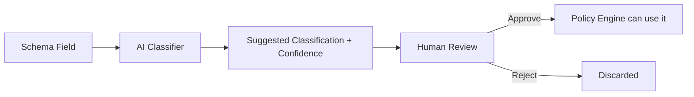

# AI_CLASSIFICATION.md

AI classification suggests a data classification (PII, PCI, PHI, NON_SENSITIVE) for a schema field, but never affects enforcement without human approval. See [POLICY_DSL.md](./POLICY_DSL.md) for how `dataClass` is used once approved.

## Flow

## Example

| Field | Suggested Class |
|---|---|
| `email` | PII |
| `cardNumber` | PCI |
| `phone` | PII |
| `orderId` | NON_SENSITIVE |

## Inputs

A field name (and optionally sample metadata such as type or a description) submitted via `POST /ai/classify` (see [API_SPEC.md](./API_SPEC.md)).

## Outputs

A suggested `dataClass` and a `confidence` score (0.0–1.0), persisted as an `AIClassification` row with `status: PENDING`.

## Confidence

Confidence is surfaced to the reviewer as-is; PolicyMesh does not currently auto-approve above any confidence threshold — **every** suggestion requires an explicit human action.

## Human Approval

`POST /ai/classify/{id}/approve` or `POST /ai/classify/{id}/reject`, restricted to ADMIN/COMPLIANCE_OFFICER (see [AUTHENTICATION.md](./AUTHENTICATION.md)). Only an `APPROVED` classification may be referenced when creating or updating a `DataFlowEdge`'s `dataClasses`.

## Failure Handling

If the AI service is unreachable or errors, `POST /ai/classify` returns a 503 (see [ERROR_HANDLING.md](./ERROR_HANDLING.md)); the caller can fall back to manually specifying the `dataClass` when registering a data flow — AI classification is an assistive convenience, never a hard dependency.

## AI Service Abstraction

The Python FastAPI AI service sits behind a narrow internal interface (`classify(fieldName) -> { class, confidence }`) so the underlying LLM provider can be swapped without changing the Java backend.

## Privacy Considerations

Only field **names/metadata** are sent to the AI service — not actual data values — to avoid exposing real PII/PCI/PHI content to a third-party model.

## Mock Mode

For demo reliability, the AI service supports a **mock mode** that returns deterministic canned suggestions (e.g., the table above) without calling a live LLM API. This avoids demo failures due to network/API-key issues; it is explicitly a demo aid, not a claim about production AI accuracy.

## Scope Note

AI classification is an optional assistive feature. The core PolicyMesh enforcement engine (Policy Engine, Graph Engine, Runtime Enforcement) does not require AI classification to function — `dataClass` can always be set manually.
