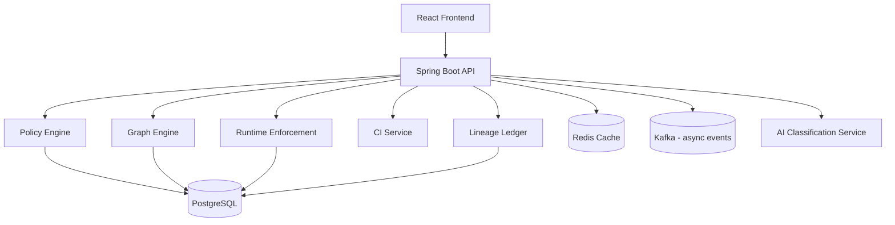
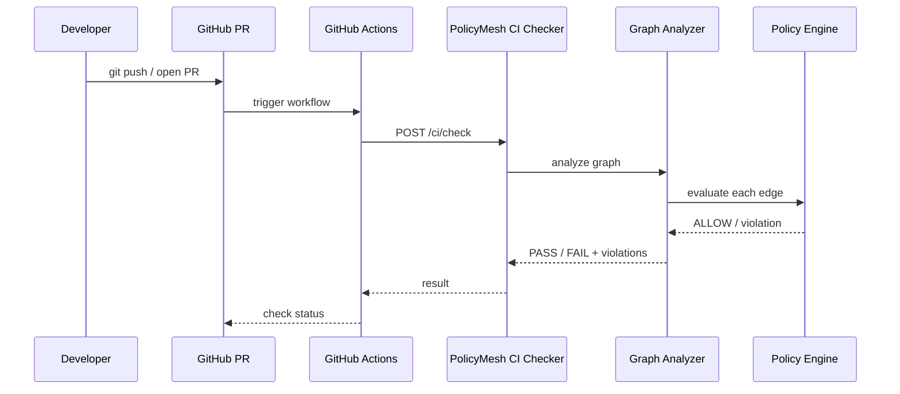
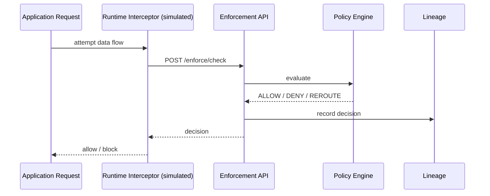
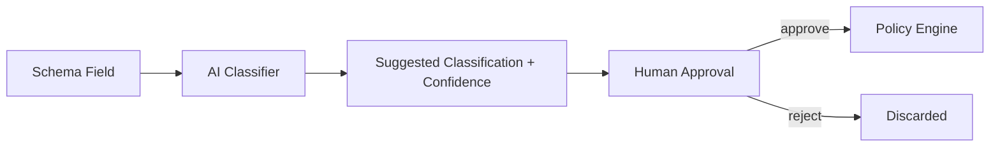

# ARCHITECTURE.md

This document explains how PolicyMesh's components fit together. See [TECH_STACK.md](./TECH_STACK.md) for technology choices and [GLOSSARY.md](./GLOSSARY.md) for terminology.

## High-Level Architecture

- **React Frontend** — dashboard, policy editor, graph visualization (React Flow), charts (Recharts). See [FRONTEND_CONTRACT.md](./FRONTEND_CONTRACT.md).
- **Spring Boot API** — the single backend entry point; exposes all REST APIs (see [API_SPEC.md](./API_SPEC.md)).
- **Policy Engine** — evaluates a data flow against compiled policy (see [POLICY_COMPILER.md](./POLICY_COMPILER.md)).
- **Graph Engine** — models services/data flows and runs CI-time analysis (see [GRAPH_ENGINE.md](./GRAPH_ENGINE.md)).
- **Runtime Enforcement** — evaluates live requests (see [RUNTIME_ENFORCEMENT.md](./RUNTIME_ENFORCEMENT.md)).
- **CI Service** — the API surface GitHub Actions calls (see [CI_INTEGRATION.md](./CI_INTEGRATION.md)).
- **Lineage Ledger** — hash-chained decision record (see [LINEAGE_LEDGER.md](./LINEAGE_LEDGER.md)).
- **PostgreSQL** — source of truth for all entities (see [DATABASE_SCHEMA.md](./DATABASE_SCHEMA.md)).
- **Redis** — cache for compiled policies (see [REDIS.md](./REDIS.md)).
- **Kafka** — asynchronous event bus for non-blocking notifications (see [KAFKA.md](./KAFKA.md)).
- **AI Classification Service** — Python FastAPI service suggesting data classifications (see [AI_CLASSIFICATION.md](./AI_CLASSIFICATION.md)).

## CI Flow

## Runtime Flow

## AI Flow

## What Is Real vs Simulated in the MVP

| Component | MVP Status |
|---|---|
| Policy Engine, Graph Engine, CI checker | Real — implemented in Spring Boot |
| Lineage hash chaining | Real — SHA-256 chain in PostgreSQL |
| Runtime Enforcement API | Real API, but the "interceptor" is a **simulator** UI/endpoint that submits example requests rather than a live service-mesh sidecar |
| AI Classification | Real API surface; underlying model call can run in **mock mode** for demo reliability (see [AI_CLASSIFICATION.md](./AI_CLASSIFICATION.md)) |
| Kafka | Real broker in Docker Compose, used for non-blocking event notification only — never required for a synchronous decision |
| Redis | Real cache; system must degrade gracefully to PostgreSQL if unavailable |

Future architecture (Istio/Envoy sidecars, multi-region, Kubernetes) is described in [DEPLOYMENT.md](./DEPLOYMENT.md) and [ROADMAP.md](./ROADMAP.md), and is explicitly not implemented in the MVP.
