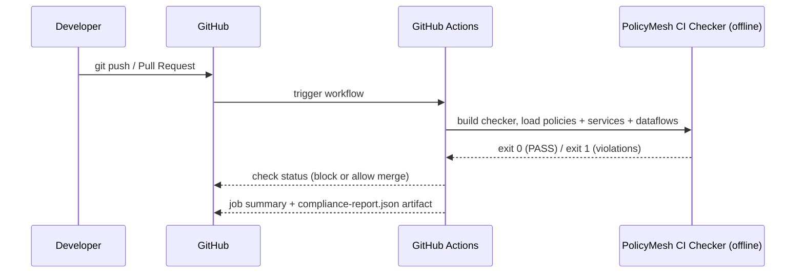

# CI_INTEGRATION.md

PolicyMesh integrates with GitHub Actions so that a disallowed data flow is caught **before merge**, not after deployment. See [GRAPH_ENGINE.md](./GRAPH_ENGINE.md) for the analysis algorithm, [API_SPEC.md](./API_SPEC.md) for the backend API contract, and [`.github/README.md`](../.github/README.md) for the workflow inventory.

## Flow



## What GitHub provides

- The pull-request event and workflow triggers.
- The ability to mark a check as required for merge (branch protection).
- Nothing about data residency — GitHub has no built-in concept of "region" or "data class."

## What PolicyMesh provides

- The actual compliance analysis: the standalone CI checker (`ci-checker/`)
  loads policies from `policies/{EU,GLOBAL,INDIA,US}`, services from
  `examples/services/services.json`, and data flows from
  `examples/dataflows/*.json`, builds the compliance graph, and determines
  PASS/FAIL deterministically (same allow/deny semantics as the runtime
  backend engine).
- A machine-readable JSON report and a human-readable GitHub job summary.

## Exit codes

The workflow maps the checker's exit code directly to the check result:

| Exit code | Meaning | GitHub Actions result |
|---|---|---|
| 0 | Compliance passed | ✅ |
| 1 | Violations found | ❌ |
| 2 | Configuration/input error | ⚠️ workflow error |
| 3 | Backend integration error (backend-assisted mode only) | ⚠️ workflow error |
| 4 | Unexpected internal error | ⚠️ workflow error |

## Violations

Each violation names the offending edge and the reason, e.g.:

```text
❌ orders-api [EU] → analytics-api [US]
   Data class: PII
   Policy: EU-PII-001
   Reason: EU PII cannot be transferred from EU to US
```

The same table (source, destination, data class, policy, reason) is
rendered in the job summary of the `PolicyMesh / Compliance` job, and a
`compliance-report.json` artifact is uploaded on every run.

## Valid vs intentionally-failing fixtures

CI never fails merely because demo data is *supposed* to be invalid:

- `examples/dataflows/valid-flow.json` — the repository's **real, compliant**
  configuration. This is what the compliance gate evaluates; it must pass.
- `examples/dataflows/blocked-flow.json` and `mixed-flow.json` —
  **intentionally** violating demo flows. They are exercised only in the
  checker's behavioral tests, where exit code 1 is the *expected* outcome
  and proves the checker works.
- `examples/dataflows/reroute-flow.json` — a documented `FUTURE_FEATURE`,
  not executed by CI.

## Running the same check locally

```bash
bash .github/scripts/run-policy-check.sh \
  --services examples/services/services.json \
  --dataflows examples/dataflows/valid-flow.json
```

JSON / GitHub-Markdown output:

```bash
java -jar ci-checker/target/policymesh-ci.jar check \
  --policy-dir <assembled-policy-dir> \
  --services examples/services/services.json \
  --dataflows examples/dataflows/valid-flow.json \
  --output json
```

(`run-policy-check.sh` assembles the policy directory automatically — do not
point `--policy-dir` at `policies/` directly, it contains non-policy YAML
such as schemas and test cases.)

## Backend-assisted mode (optional)

The checker can evaluate the graph registered in the backend instead of
local files:

```bash
java -jar policymesh-ci.jar check \
  --backend-url https://policymesh-api.example.com \
  --token "$POLICYMESH_API_TOKEN"
```

This mode is **not** used by the default workflows: offline mode is
self-contained and needs no secrets or running infrastructure. To adopt
backend-assisted CI, store the URL and token as GitHub repository secrets
and extend `.github/workflows/policymesh-ci.yml` accordingly
(`POST /api/v1/ci/check` remains available for manual/scripted use — see
[API_SPEC.md](./API_SPEC.md)).

## Blocking merges

Configure `PolicyMesh / Compliance` (and the backend/AI test checks) as
**required status checks** in the repository's branch protection rules so a
FAIL result blocks merging. See [`.github/README.md`](../.github/README.md)
for the exact check names and setup steps.

**Important:** GitHub does not automatically understand data residency. PolicyMesh performs the actual analysis and reports a PASS/FAIL result that GitHub Actions merely surfaces as a check.
