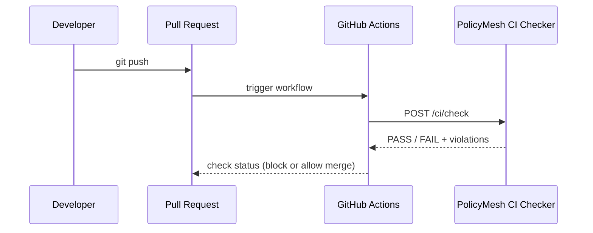

# CI_INTEGRATION.md

PolicyMesh integrates with GitHub Actions so that a disallowed data flow is caught **before merge**, not after deployment. See [GRAPH_ENGINE.md](./GRAPH_ENGINE.md) for the analysis algorithm and [API_SPEC.md](./API_SPEC.md) for the exact API contract.

## Flow



## What GitHub Provides

- The pull-request event and workflow trigger.
- The ability to mark a check as required for merge (branch protection).
- Nothing about data residency — GitHub has no built-in concept of "region" or "data class."

## What PolicyMesh Provides

- The actual compliance analysis: it reads the current service/data-flow graph and compiled policies, and determines PASS/FAIL.
- A machine-readable JSON result and a human-readable summary.

## What the CI Checker Reads

- The current `ServiceNode` / `DataFlowEdge` graph as stored in PostgreSQL (the graph reflects what the team has registered; in the MVP this registration is manual via the API/UI, not auto-discovered from source code).
- All `ACTIVE` policies applicable to the data classes present in the graph.

## How Violations Are Produced

Each violation from the Graph Engine (see [GRAPH_ENGINE.md](./GRAPH_ENGINE.md)) becomes one entry in the CI result's `violations` array, each with the offending edge and a human-readable reason.

## Exit Codes / JSON Output

`POST /ci/check` always returns HTTP 200 with a body:

```json
{ "scanId": "ci-43", "result": "FAIL", "violations": [ { "edge": "orders-api -> analytics-api", "reason": "PII EU to US denied by EU-PII-001" } ] }
```

The CI script wrapping this call is responsible for translating `result: FAIL` into a non-zero shell exit code so GitHub Actions marks the check as failed.

## Human-Readable Output

The CI script should also print each violation as a readable line, e.g.:

```text
❌ orders-api -> analytics-api: PII EU to US denied by EU-PII-001
```

## Blocking Merges

Configure the `policymesh-ci` check as a **required status check** in the repository's branch protection rules so a `FAIL` result blocks merging.

## When No Violations Exist

`POST /ci/check` returns `{ "result": "PASS", "violations": [] }` and the CI script exits 0, allowing the merge to proceed.

## Example Workflow

`.github/workflows/policymesh-ci.yml`:

```yaml
name: PolicyMesh Compliance Check

on:
  pull_request:
    branches: [main]

jobs:
  policymesh-check:
    runs-on: ubuntu-latest
    steps:
      - name: Checkout
        uses: actions/checkout@v4

      - name: Run PolicyMesh CI Check
        env:
          POLICYMESH_API_URL: ${{ secrets.POLICYMESH_API_URL }}
          POLICYMESH_TOKEN: ${{ secrets.POLICYMESH_TOKEN }}
        run: |
          RESPONSE=$(curl -s -X POST "$POLICYMESH_API_URL/api/v1/ci/check" \
            -H "Authorization: Bearer $POLICYMESH_TOKEN" \
            -H "Content-Type: application/json")
          echo "$RESPONSE"
          RESULT=$(echo "$RESPONSE" | jq -r '.result')
          if [ "$RESULT" != "PASS" ]; then
            echo "❌ PolicyMesh compliance check failed"
            echo "$RESPONSE" | jq -r '.violations[] | "  - " + .edge + ": " + .reason'
            exit 1
          fi
          echo "✅ PolicyMesh compliance check passed"
```

## Local CI Testing

A developer can reproduce the same check locally: `curl -X POST http://localhost:8080/api/v1/ci/check -H "Authorization: Bearer $TOKEN"` (see [LOCAL_DEVELOPMENT.md](./LOCAL_DEVELOPMENT.md)).

**Important:** GitHub does not automatically understand data residency. PolicyMesh performs the actual analysis and reports a PASS/FAIL result that GitHub Actions merely surfaces as a check.
