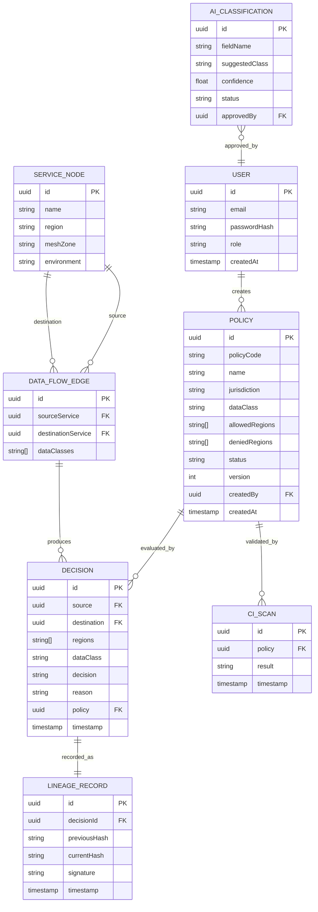

# DATABASE_SCHEMA.md

Source of truth: PostgreSQL. See [REDIS.md](./REDIS.md) for what is cached vs authoritative, and [POLICY_DSL.md](./POLICY_DSL.md) for policy field semantics.

## ER Diagram

## User

**Purpose:** Authentication and role-based access.

| Column | Type | Nullable | Notes |
|---|---|---|---|
| id | UUID (PK) | No | |
| email | VARCHAR(255) | No | Unique |
| passwordHash | VARCHAR(255) | No | BCrypt hash, never plaintext |
| role | ENUM(ADMIN, COMPLIANCE_OFFICER, ENGINEER, VIEWER) | No | |
| createdAt | TIMESTAMP | No | |

Indexes: unique index on `email`.

## Policy

**Purpose:** Declarative data-residency rule (see [POLICY_DSL.md](./POLICY_DSL.md)).

| Column | Type | Nullable | Notes |
|---|---|---|---|
| id | UUID (PK) | No | |
| policyCode | VARCHAR(64) | No | Unique, e.g. `EU-PII-001` |
| name | VARCHAR(255) | No | |
| jurisdiction | VARCHAR(64) | No | e.g. `EU` |
| dataClass | VARCHAR(64) | No | e.g. `PII` |
| allowedRegions | TEXT[] (array) | No | e.g. `{EU}` |
| deniedRegions | TEXT[] (array) | No | e.g. `{US,CN}` |
| status | ENUM(DRAFT, ACTIVE, INACTIVE) | No | |
| version | INTEGER | No | Incremented on every update |
| createdBy | UUID (FK → User.id) | No | |
| createdAt | TIMESTAMP | No | |

Indexes: unique index on `policyCode`; index on `(dataClass, jurisdiction)` for fast lookup.

Foreign keys: `createdBy` → `User.id`.

## ServiceNode

**Purpose:** Represents a service in the infrastructure graph.

| Column | Type | Nullable | Notes |
|---|---|---|---|
| id | UUID (PK) | No | |
| name | VARCHAR(255) | No | Unique, e.g. `orders-api` |
| region | VARCHAR(64) | No | e.g. `EU`, `US`, `CN` |
| meshZone | VARCHAR(64) | Yes | Optional grouping |
| environment | VARCHAR(64) | No | e.g. `production`, `staging` |

Indexes: unique index on `name`; index on `region`.

## DataFlowEdge

**Purpose:** Represents a data flow between two services.

| Column | Type | Nullable | Notes |
|---|---|---|---|
| id | UUID (PK) | No | |
| sourceService | UUID (FK → ServiceNode.id) | No | |
| destinationService | UUID (FK → ServiceNode.id) | No | |
| dataClasses | TEXT[] (array) | No | e.g. `{PII}` |

Indexes: composite index on `(sourceService, destinationService)`; duplicate edges between the same pair with overlapping `dataClasses` are rejected at the application layer (see [GRAPH_ENGINE.md](./GRAPH_ENGINE.md)).

## Decision

**Purpose:** The outcome of evaluating a data flow against policy (CI or runtime).

| Column | Type | Nullable | Notes |
|---|---|---|---|
| id | UUID (PK) | No | |
| source | UUID (FK → ServiceNode.id) | No | |
| destination | UUID (FK → ServiceNode.id) | No | |
| regions | TEXT[] (array) | No | `[sourceRegion, destinationRegion]` |
| dataClass | VARCHAR(64) | No | |
| decision | ENUM(ALLOW, DENY, REROUTE) | No | |
| reason | TEXT | No | Human-readable explanation |
| policy | UUID (FK → Policy.id) | No | Policy version that produced this decision |
| timestamp | TIMESTAMP | No | |

Indexes: index on `timestamp`; index on `policy`.

## LineageRecord

**Purpose:** Hash-chained, tamper-evident record of a Decision (see [LINEAGE_LEDGER.md](./LINEAGE_LEDGER.md)).

| Column | Type | Nullable | Notes |
|---|---|---|---|
| id | UUID (PK) | No | |
| decisionId | UUID (FK → Decision.id) | No | Unique (1:1 with Decision) |
| previousHash | VARCHAR(64) | Yes | Null only for the first record in the chain |
| currentHash | VARCHAR(64) | No | SHA-256 hex digest |
| signature | VARCHAR(512) | Yes | Reserved for future digital signatures — not implemented in MVP |
| timestamp | TIMESTAMP | No | |

Indexes: unique index on `decisionId`; index on `currentHash`.

## CIScan

**Purpose:** Record of a single CI check invocation.

| Column | Type | Nullable | Notes |
|---|---|---|---|
| id | UUID (PK) | No | |
| policy | UUID (FK → Policy.id) | Yes | Nullable if scan covered multiple policies |
| result | ENUM(PASS, FAIL) | No | |
| timestamp | TIMESTAMP | No | |

## AIClassification

**Purpose:** AI-suggested classification pending human approval (see [AI_CLASSIFICATION.md](./AI_CLASSIFICATION.md)).

| Column | Type | Nullable | Notes |
|---|---|---|---|
| id | UUID (PK) | No | |
| fieldName | VARCHAR(255) | No | e.g. `email` |
| suggestedClass | VARCHAR(64) | No | e.g. `PII` |
| confidence | FLOAT | No | 0.0–1.0 |
| status | ENUM(PENDING, APPROVED, REJECTED) | No | |
| approvedBy | UUID (FK → User.id) | Yes | Null until approved/rejected |

## Enum/Array Notes

- All region and data-class lists (`allowedRegions`, `deniedRegions`, `dataClasses`, `regions`) are stored as PostgreSQL `TEXT[]` arrays, not free-text CSV.
- `decision` and `status` fields use PostgreSQL enum types (or `VARCHAR` with a `CHECK` constraint, implementation's choice) to keep values closed and consistent.
