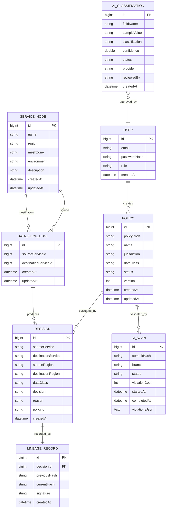

# DATABASE_SCHEMA.md

Authoritative Source of Truth: **MySQL 8.4**.
Cache: **Redis 7** (see [REDIS.md](./REDIS.md) for what is cached vs authoritative).
Policy Semantics: [POLICY_DSL.md](./POLICY_DSL.md).

## ER Diagram

## Tables Overview

### 1. `users`
**Purpose:** Authentication and role-based access control.
- `id` BIGINT AUTO_INCREMENT PK
- `email` VARCHAR(255) UNIQUE NOT NULL
- `password_hash` VARCHAR(255) NOT NULL (BCrypt hash)
- `role` VARCHAR(50) NOT NULL (`ADMIN`, `SECURITY_ADMIN`, `AUDITOR`, `VIEWER`)
- `created_at` DATETIME(6) NOT NULL

### 2. `policies` & Region Tables
**Purpose:** Declarative data-residency compliance rules.
- `policies`: `id` BIGINT PK, `policy_code` VARCHAR(100) UNIQUE, `name` VARCHAR(255), `jurisdiction` VARCHAR(100), `data_class` VARCHAR(100), `status` VARCHAR(50), `version` INT, `created_at`, `updated_at`.
- `policy_allowed_regions`: `policy_id` BIGINT FK, `region` VARCHAR(100).
- `policy_denied_regions`: `policy_id` BIGINT FK, `region` VARCHAR(100).

### 3. `service_nodes`
**Purpose:** Nodes in the service mesh graph topology.
- `id` BIGINT AUTO_INCREMENT PK
- `name` VARCHAR(255) UNIQUE NOT NULL
- `region` VARCHAR(100) NOT NULL (`EU`, `US`, `IN`, `APAC`, `GLOBAL`)
- `mesh_zone` VARCHAR(100)
- `environment` VARCHAR(50) NOT NULL
- `description` VARCHAR(1000)

### 4. `data_flow_edges` & `data_flow_edge_classes`
**Purpose:** Directed communications between services with tagged data classes.
- `data_flow_edges`: `id` BIGINT PK, `source_service_id` BIGINT, `destination_service_id` BIGINT.
- `data_flow_edge_classes`: `edge_id` BIGINT FK, `data_class` VARCHAR(100).

### 5. `decisions`
**Purpose:** Real-time enforcement evaluation audit log.
- `id` BIGINT AUTO_INCREMENT PK
- `source_service`, `destination_service`, `source_region`, `destination_region`, `data_class`
- `decision` VARCHAR(20) (`ALLOW`, `DENY`, `REROUTE`)
- `policy_id` VARCHAR(100), `reason` VARCHAR(1000), `created_at` DATETIME(6)

### 6. `lineage_records`
**Purpose:** Cryptographically chained, tamper-evident audit ledger.
- `id` BIGINT AUTO_INCREMENT PK
- `decision_id` BIGINT UNIQUE NOT NULL
- `previous_hash` VARCHAR(128)
- `current_hash` VARCHAR(128) NOT NULL (SHA-256)
- `signature` VARCHAR(512)

### 7. `ci_scans`
**Purpose:** History of standalone CI compliance evaluation runs.

### 8. `ai_classifications`
**Purpose:** AI-assisted data field discovery and sensitivity tagging.
