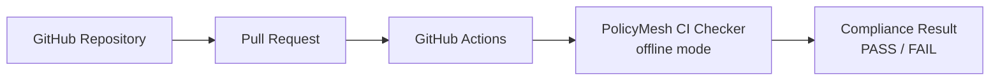

# GITHUB_INTEGRATION.md

How the PolicyMesh repository integrates with GitHub. The authoritative
reference for the `.github/` directory is [`.github/README.md`](../.github/README.md);
this page summarizes the integration and points to it.

See also [CI_INTEGRATION.md](./CI_INTEGRATION.md) for the compliance flow itself.

## Flow



The workflows build the standalone CI checker (`ci-checker/`) from source on
every run, evaluate it against the policy files (`policies/{EU,GLOBAL,INDIA,US}`)
and the repository's valid data-flow configuration
(`examples/dataflows/valid-flow.json`), and turn the checker's exit code into
a GitHub check.

## What is committed in `.github/workflows/`

| File | Purpose |
|---|---|
| `policymesh-ci.yml` | Main gate: policy lint, checker tests, `PolicyMesh / Compliance`, final status |
| `backend-ci.yml` | `mvn test` + package for `backend/` (Java 21) |
| `frontend-ci.yml` | Dormant — activates when `frontend/` with a lockfile exists |
| `ai-service-ci.yml` | `pytest` for `ai-service/` (Python 3.11, mock provider) |
| `docker-build.yml` | Build-only Dockerfile validation |
| `release.yml` | `v*` tag releases: tests + compliance + artifacts |

## What PolicyMesh reads from the repository

In offline mode (the default in CI): the policy YAML under `policies/`, the
service inventory `examples/services/services.json`, and the data-flow
configurations under `examples/dataflows/`. The graph is file-based, not
database-derived; runtime registrations live in PostgreSQL via the backend API.

## PR checks

Each workflow job appears as a status check, e.g.:

- ✅ / ❌ `PolicyMesh / Compliance` — the compliance gate
- `PolicyMesh / Policy validation`, `PolicyMesh / CI checker tests`, `PolicyMesh / Final status`
- `Backend CI / Backend tests`, `AI Service CI / AI service tests`

Job summaries contain the Markdown compliance report; every run uploads a
`compliance-report.json` artifact.

## Merge blocking

Repository administrators configure (once):

```text
Settings → Branches → Branch protection → Require status checks
```

and require `PolicyMesh / Compliance` (plus the backend/AI test checks). The
workflows never modify repository settings themselves.

## Local CI testing

Run the identical gate locally before pushing:

```bash
bash .github/scripts/run-policy-check.sh \
  --services examples/services/services.json \
  --dataflows examples/dataflows/valid-flow.json
```

Or `scripts/scripts/run-ci-check.sh --scenario valid|blocked|mixed`.
See [LOCAL_DEVELOPMENT.md](./LOCAL_DEVELOPMENT.md).
