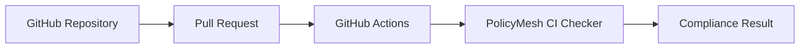

# GITHUB_INTEGRATION.md

See [CI_INTEGRATION.md](./CI_INTEGRATION.md) for the full CI flow this integration triggers.

## Flow



## What Gets Committed into `.github/workflows/`

A single workflow file, `policymesh-ci.yml` (full example in [CI_INTEGRATION.md](./CI_INTEGRATION.md)), triggered on `pull_request` events targeting the protected branch. It calls `POST /ci/check` and fails the job on a non-PASS result.

## What PolicyMesh Reads from the Repository

Nothing directly — in the MVP, PolicyMesh does not clone or parse repository source code. It evaluates the **currently registered** service/data-flow graph in PostgreSQL (registered via the API/UI by engineers), not a graph auto-derived from source. This is a deliberate MVP simplification; auto-discovery from IaC/source is future work (see [ROADMAP.md](./ROADMAP.md)).

## PR Checks

The `policymesh-ci` job appears as a GitHub status check on the pull request, showing PASS (green) or FAIL (red) with a link to the run logs.

## Merge Blocking

Add `policymesh-ci` as a **required status check** under the repository's branch protection settings so a FAIL result prevents merging.

## Local CI Testing

Run the same check manually before pushing:

```bash
curl -X POST http://localhost:8080/api/v1/ci/check -H "Authorization: Bearer $TOKEN"
```

See [LOCAL_DEVELOPMENT.md](./LOCAL_DEVELOPMENT.md).
