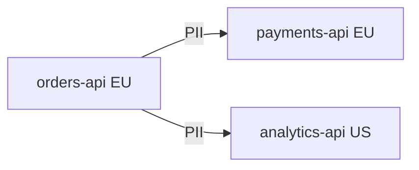

# GRAPH_ENGINE.md

The Graph Engine models an organization's infrastructure as a directed graph and analyzes it against compiled policy (see [POLICY_COMPILER.md](./POLICY_COMPILER.md)). It powers both `POST /graph/validate` and `POST /ci/check` (see [API_SPEC.md](./API_SPEC.md), [CI_INTEGRATION.md](./CI_INTEGRATION.md)).

## Model

- **Node = Service** (`ServiceNode`: name, region, meshZone, environment).
- **Edge = Data Flow** (`DataFlowEdge`: sourceService, destinationService, dataClasses).



## Graph Construction

1. Load all `ServiceNode` rows as graph nodes.
2. Load all `DataFlowEdge` rows as directed edges, annotated with `dataClasses`.
3. Build an adjacency structure keyed by source service.

## Edge Metadata

Each edge carries: source region (from source node), destination region (from destination node), and one or more `dataClasses`. An edge with multiple data classes is evaluated once per data class.

## Policy Evaluation (per edge, per data class)

```text
for each edge (source -> destination) with dataClass D:
    policy = PolicyEngine.findApplicablePolicy(D, source.region)
    if policy is null:
        violation("no applicable policy for " + D)
        continue
    if destination.region in policy.deniedRegions:
        violation(edge, "denied region")
    else if destination.region not in policy.allowedRegions:
        violation(edge, "region not explicitly allowed")
    else:
        allow(edge)
```

## Violation Generation

Every evaluated edge produces either an implicit ALLOW or a `Violation { edge, reason }`. A graph analysis result is `PASS` only if there are zero violations; otherwise it is `FAIL` with the full violation list (see [API_SPEC.md](./API_SPEC.md) `POST /graph/validate`).

## Path Traversal

For the MVP, evaluation is **per-edge**, not transitive: PolicyMesh does not currently trace multi-hop paths (A → B → C) to detect indirect residency violations. This is listed as a future enhancement in [ROADMAP.md](./ROADMAP.md).

## Cycle Handling

Cycles in the data-flow graph are permitted (e.g., a request/response pattern) and do not cause an error; each edge is still evaluated independently regardless of cycles.

## Duplicate Edges

Two edges between the same `(source, destination)` pair with overlapping `dataClasses` are rejected at creation time (`POST` on the edge/data-flow endpoint) to keep the graph unambiguous. Non-overlapping data classes between the same pair are allowed as separate edges.

## Missing Nodes

An edge referencing a `sourceService` or `destinationService` that does not exist as a registered `ServiceNode` cannot be created — this is enforced by the foreign-key relationship in [DATABASE_SCHEMA.md](./DATABASE_SCHEMA.md) and validated at the API layer with a 422.

## Invalid Graph States

A graph with zero nodes or zero edges is valid and trivially `PASS` (nothing to violate). The Graph Engine does not require a "complete" graph to run analysis.

## CI Analysis Algorithm (pseudocode)

```text
function analyzeGraph(graph):
    violations = []
    for edge in graph.edges:
        for dataClass in edge.dataClasses:
            result = evaluateEdge(edge, dataClass)
            if result.violation:
                violations.append(result)
    return { result: violations.isEmpty() ? "PASS" : "FAIL", violations: violations }
```

This is the exact function invoked by both `POST /graph/validate` and `POST /ci/check`.
