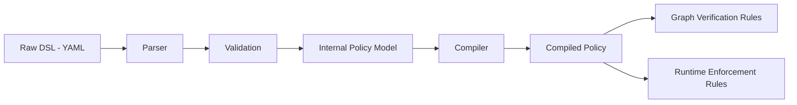

# POLICY_COMPILER.md

The Policy Compiler turns a validated [Policy DSL](./POLICY_DSL.md) document into a single internal representation consumed by both the [Graph Engine](./GRAPH_ENGINE.md) (CI) and the [Runtime Enforcement](./RUNTIME_ENFORCEMENT.md) engine. This is PolicyMesh's core differentiator: one compiled source, two enforcement points.

## Pipeline

1. **Parser** — parses the YAML into a raw structure.
2. **Validation** — applies the rules in [POLICY_DSL.md](./POLICY_DSL.md) §Validation Rules; invalid input is rejected here and never reaches the compiler.
3. **Internal Policy Model** — a normalized, in-memory representation: `{ dataClass, jurisdiction, allowedRegions: Set<Region>, deniedRegions: Set<Region> }`.
4. **Compiler** — produces the **Compiled Policy**, a lookup-optimized structure keyed by `dataClass` for O(1) evaluation.

## Why the Compiler Exists

Without it, the Graph Engine and Runtime Enforcement engine would each need their own copy of "how to interpret a policy," risking drift (e.g., CI says ALLOW but runtime says DENY for the same rule). The compiler guarantees both paths evaluate the exact same compiled structure.

## One Source, Two Consumers

- **Graph verification rules:** the Graph Engine iterates every `DataFlowEdge` in the service graph and asks the compiled policy "is `(sourceRegion → destinationRegion, dataClass)` allowed?" — used for CI's PASS/FAIL.
- **Runtime enforcement rules:** the Enforcement API asks the exact same question for a single edge at request time — used for ALLOW/DENY/REROUTE.

Both call the same `PolicyEngine.evaluate(source, destination, dataClass)` function against the same Compiled Policy.

## Caching

- The Compiled Policy for each `dataClass` is cached in Redis under a key such as `policy:<dataClass>` (see [REDIS.md](./REDIS.md)).
- PostgreSQL remains the source of truth; Redis is purely a performance optimization.

## Versioning and Invalidation

- Every policy update produces a new `version` (see [DATABASE_SCHEMA.md](./DATABASE_SCHEMA.md)) and triggers cache invalidation for that policy's cache key.
- A `policymesh.policy.updated` Kafka event (see [KAFKA.md](./KAFKA.md)) is published so other components (dashboard, future distributed instances) can react asynchronously — this event is a notification, not a requirement for correctness, since any cache miss simply recompiles from PostgreSQL.

## Scope Note

The MVP compiler performs **structural compilation and lookup optimization only**. It does not perform formal verification (e.g., proving the absence of policy conflicts across all possible graphs) — that is listed as a future capability in [ROADMAP.md](./ROADMAP.md) and is not claimed here.
