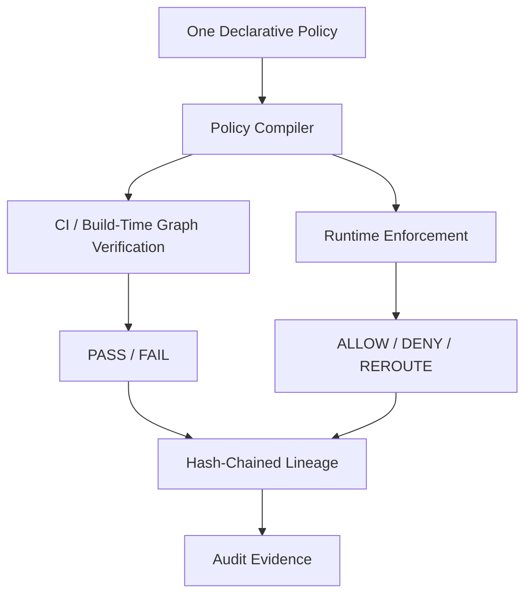

# PROJECT_OVERVIEW.md

## What is PolicyMesh?

PolicyMesh is a **policy-as-code platform for data-residency and cross-border data-flow compliance**. It lets an organization declare data-residency rules once, in a single declarative policy, and enforces those same rules at two points in the software lifecycle: **before deployment** (CI/build-time graph verification) and **after deployment** (runtime enforcement). Every decision made by either path is recorded as **hash-chained lineage** to produce audit-grade evidence.



## The Problem

Organizations that operate across jurisdictions (EU, US, CN, etc.) must ensure personal and regulated data does not flow into disallowed regions. Today this is handled by:

- Manually written compliance documents that describe *intent* but are disconnected from *actual infrastructure*.
- Point-in-time audits that check policy documents, not real data movement.
- No shared source of truth between engineering (who builds data flows) and compliance (who defines the rules).

## Why Current Approaches Are Insufficient

- Compliance documents are static text; they do not verify what infrastructure actually does.
- CI pipelines have no concept of "data residency" — a pull request can introduce a disallowed cross-border data flow and merge cleanly.
- Runtime systems have no enforcement layer tied to the same policy source used at build time.
- There's no tamper-evident record proving what was allowed or denied and why.

## Who Uses PolicyMesh

- **Compliance Officers** — define and manage data-residency policy.
- **Engineers** — register services and data flows, and get PASS/FAIL feedback in CI.
- **Admins** — manage users, roles, and platform configuration.
- **Auditors / Viewers** — inspect lineage and verify audit evidence.

## Product Vision

A single declarative policy source that drives both build-time verification and runtime enforcement, with every decision permanently and verifiably recorded.

## Core Innovation

The **same compiled policy** produces both graph-verification rules (CI) and enforcement rules (runtime) — eliminating drift between "what compliance wrote" and "what actually runs."

## Main Features

- Declarative Policy DSL (YAML) for data-residency rules.
- Policy Compiler that produces a single compiled representation used by both CI and runtime.
- Graph Engine modeling services (nodes) and data flows (edges).
- CI Integration that fails a pull request when a disallowed data flow is introduced.
- Runtime Enforcement that evaluates live requests and issues ALLOW / DENY / REROUTE.
- Hash-chained Lineage Ledger recording every decision.
- AI-assisted data classification with mandatory human approval.
- Role-based dashboard for policies, graph, CI scans, lineage, and audit queries.

## MVP Scope

See [ROADMAP.md](./ROADMAP.md) for the authoritative MVP/Phase breakdown. In summary, the MVP includes: policy CRUD, policy compiler, graph engine, CI checker, a simulated runtime enforcement path, hash-chained lineage, JWT/RBAC authentication, dashboard summary APIs, and basic AI classification with human approval.

## Explicitly Out of Scope for the Hackathon

- Real service-mesh/sidecar interception (Istio/Envoy) — see [RUNTIME_ENFORCEMENT.md](./RUNTIME_ENFORCEMENT.md).
- WORM storage and digital signatures on lineage records — see [LINEAGE_LEDGER.md](./LINEAGE_LEDGER.md).
- Multi-region/multi-cloud deployment — see [DEPLOYMENT.md](./DEPLOYMENT.md).
- Formal verification of policies.
- Legal certification of any kind.

## High-Level Workflow

1. A Compliance Officer authors a policy (e.g., "EU PII Protection") in the Policy DSL.
2. The Policy Compiler validates and compiles it into an internal model used by both the Graph Engine and the Enforcement Engine.
3. An Engineer registers services (`orders-api`, `payments-api`, `analytics-api`) and the data flows between them.
4. On every pull request, CI runs the PolicyMesh checker against the current service graph; it fails the build if a disallowed flow is introduced.
5. At runtime, the (simulated) enforcement layer evaluates each request against the same compiled policy and returns ALLOW / DENY / REROUTE.
6. Every decision — CI or runtime — is written to the hash-chained Lineage Ledger.
7. Auditors query lineage and verify the chain has not been tampered with.

## Example Scenario

```text
orders-api   (Region: EU)
payments-api (Region: EU)
analytics-api (Region: US)

Customer PII: name, email, phone, address → classified as PII

Policy "EU PII Protection":
  allowedRegions: [EU]
  deniedRegions:  [US, CN]

orders-api (EU) -> payments-api (EU)   => ✅ ALLOW
orders-api (EU) -> analytics-api (US)  => ❌ DENY
```

CI detects the invalid route before deployment; runtime enforcement blocks it if attempted while running; a lineage record documents each decision and joins the hash chain.

## Expected Value

- Compliance rules become executable and continuously verified, not just documented.
- Engineers get immediate, actionable feedback in CI instead of failing a later audit.
- Auditors get tamper-evident, queryable evidence of every compliance decision.

## Important Disclaimer

> PolicyMesh detects and enforces **technical policy rules** describing where data is allowed to flow. It does not replace legal advice, and it does not by itself make an organization legally compliant with any regulation. PolicyMesh is not claimed to be production-certified.
