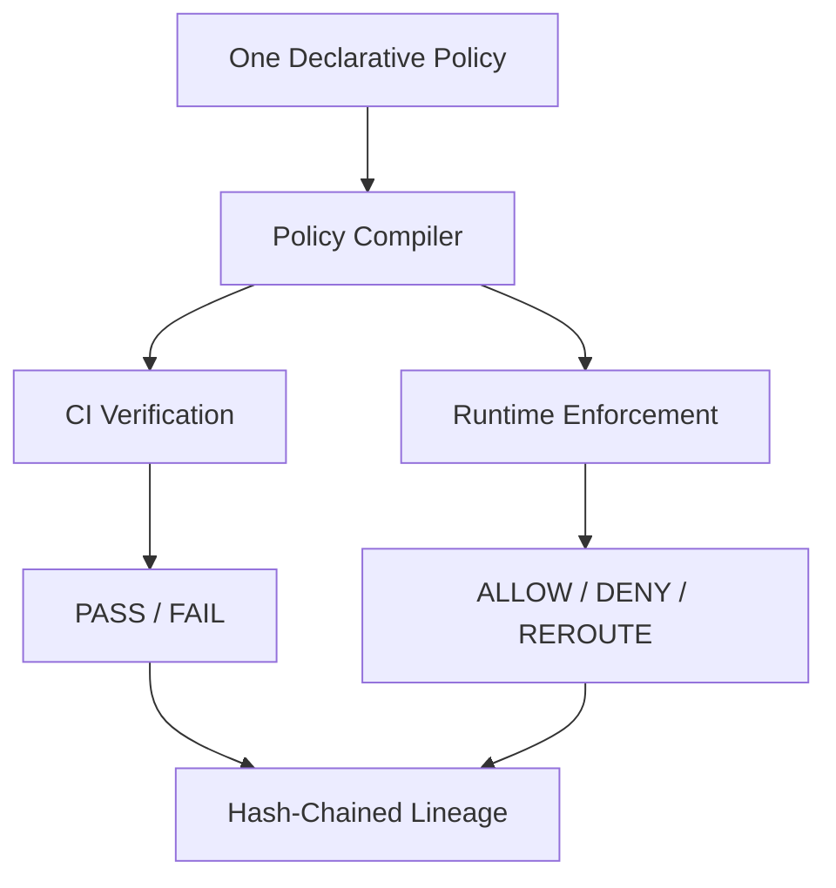

# PolicyMesh

> Policy-as-code enforcement for data residency and cross-border data flows.

## Problem

Organizations operating across jurisdictions must ensure personal and regulated data doesn't flow into disallowed regions. Compliance documents describe *intent*, but nothing verifies that infrastructure actually behaves that way — before or after deployment.

## Solution

PolicyMesh compiles one declarative policy into rules used by **both** CI-time graph verification and runtime enforcement, and records every decision in a hash-chained lineage ledger for audit-grade evidence.



> PolicyMesh detects and enforces **technical** policy rules. It does not replace legal advice and does not by itself make an organization legally compliant.

## Features

- Declarative Policy DSL (YAML)
- Policy Compiler shared by CI and runtime
- Graph Engine for service/data-flow modeling
- CI integration that blocks non-compliant pull requests
- Runtime enforcement (simulated in the MVP) returning ALLOW / DENY / REROUTE
- Hash-chained Lineage Ledger for tamper-evident audit trails
- AI-assisted data classification with mandatory human approval
- JWT/RBAC with four roles: ADMIN, COMPLIANCE_OFFICER, ENGINEER, VIEWER

## Tech Stack

Java 21 + Spring Boot 3 · PostgreSQL · Redis · Kafka · Python FastAPI (AI) · React + TypeScript · Docker

Full detail: [docs/TECH_STACK.md](./docs/TECH_STACK.md)

## Quick Start

```bash
git clone <repo-url>
cd PolicyMesh
docker compose up -d
cd backend && mvn spring-boot:run
```

Full detail: [docs/LOCAL_DEVELOPMENT.md](./docs/LOCAL_DEVELOPMENT.md)

## Example

```text
orders-api   (EU) -> payments-api  (EU)  => ✅ ALLOW
orders-api   (EU) -> analytics-api (US)  => ❌ DENY
```

## Demo

See [docs/DEMO_FLOW.md](./docs/DEMO_FLOW.md) for the full 5-minute hackathon walkthrough.

## API

Base path `/api/v1`. Full reference: [docs/API_SPEC.md](./docs/API_SPEC.md)

## Repository Structure

```text
PolicyMesh/
├── README.md
├── docs/            ← documentation (source of truth for implementation)
├── backend/         ← Spring Boot API (to be implemented)
├── ai-service/       ← FastAPI AI classification service (to be implemented)
└── frontend/        ← React app (to be implemented)
```

## Documentation

| Topic | Doc |
|---|---|
| What is this? | [PROJECT_OVERVIEW.md](./docs/PROJECT_OVERVIEW.md) |
| Requirements | [REQUIREMENTS.md](./docs/REQUIREMENTS.md) |
| How does it work? | [ARCHITECTURE.md](./docs/ARCHITECTURE.md) |
| Tech stack | [TECH_STACK.md](./docs/TECH_STACK.md) |
| Database schema | [DATABASE_SCHEMA.md](./docs/DATABASE_SCHEMA.md) |
| API reference | [API_SPEC.md](./docs/API_SPEC.md) |
| Policy DSL | [POLICY_DSL.md](./docs/POLICY_DSL.md) |
| Policy compiler | [POLICY_COMPILER.md](./docs/POLICY_COMPILER.md) |
| Graph engine | [GRAPH_ENGINE.md](./docs/GRAPH_ENGINE.md) |
| CI integration | [CI_INTEGRATION.md](./docs/CI_INTEGRATION.md) |
| Runtime enforcement | [RUNTIME_ENFORCEMENT.md](./docs/RUNTIME_ENFORCEMENT.md) |
| Lineage ledger | [LINEAGE_LEDGER.md](./docs/LINEAGE_LEDGER.md) |
| AI classification | [AI_CLASSIFICATION.md](./docs/AI_CLASSIFICATION.md) |
| Security | [SECURITY.md](./docs/SECURITY.md) |
| Authentication | [AUTHENTICATION.md](./docs/AUTHENTICATION.md) |
| Error handling | [ERROR_HANDLING.md](./docs/ERROR_HANDLING.md) |
| Testing | [TESTING.md](./docs/TESTING.md) |
| Local development | [LOCAL_DEVELOPMENT.md](./docs/LOCAL_DEVELOPMENT.md) |
| Docker setup | [DOCKER_SETUP.md](./docs/DOCKER_SETUP.md) |
| Kafka | [KAFKA.md](./docs/KAFKA.md) |
| Redis | [REDIS.md](./docs/REDIS.md) |
| GitHub integration | [GITHUB_INTEGRATION.md](./docs/GITHUB_INTEGRATION.md) |
| Deployment | [DEPLOYMENT.md](./docs/DEPLOYMENT.md) |
| Demo flow | [DEMO_FLOW.md](./docs/DEMO_FLOW.md) |
| User flows | [USER_FLOWS.md](./docs/USER_FLOWS.md) |
| Frontend contract | [FRONTEND_CONTRACT.md](./docs/FRONTEND_CONTRACT.md) |
| Backend guidelines | [BACKEND_GUIDELINES.md](./docs/BACKEND_GUIDELINES.md) |
| Contributing | [CONTRIBUTING.md](./docs/CONTRIBUTING.md) |
| Roadmap | [ROADMAP.md](./docs/ROADMAP.md) |
| Troubleshooting | [TROUBLESHOOTING.md](./docs/TROUBLESHOOTING.md) |
| Glossary | [GLOSSARY.md](./docs/GLOSSARY.md) |

## Roadmap

MVP → Phase 2 → Phase 3 → Enterprise. See [docs/ROADMAP.md](./docs/ROADMAP.md).
