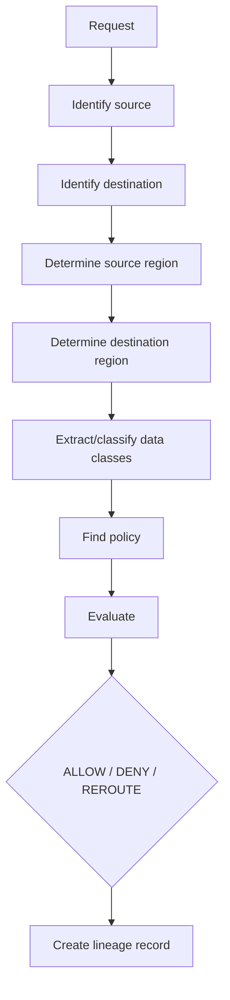

# RUNTIME_ENFORCEMENT.md

Runtime enforcement evaluates a live (or simulated) data flow request and returns ALLOW, DENY, or REROUTE, using the same compiled policy as CI (see [POLICY_COMPILER.md](./POLICY_COMPILER.md)).

## Flow

## Decisions

| Decision | Meaning |
|---|---|
| **ALLOW** | The destination region is within `allowedRegions` for the data class's applicable policy. |
| **DENY** | The destination region is in `deniedRegions`, or no applicable policy exists ("deny by default" — see [POLICY_DSL.md](./POLICY_DSL.md)). |
| **REROUTE** | Reserved for a future capability where a request is redirected to a compliant destination (e.g., an EU replica) instead of being blocked outright. In the MVP, REROUTE is a defined outcome in the API contract but is not automatically executed — it is returned as guidance only, not enforced as an actual network redirect. |

## Latency Goals (MVP, non-guaranteed)

For demo purposes, `POST /enforce/check` targets sub-second response time on a local developer machine. This is a **goal for the hackathon demo environment**, not a production SLA — no throughput or latency guarantee is made for production use.

## Simulated Runtime Environment

In the MVP, there is no live network interception. Instead:

- A "Runtime Simulator" in the UI (and/or a direct API call) lets a user submit a proposed `(source, destination, dataClass)` flow as if an application were making it.
- The Enforcement API evaluates it exactly as it would a real interception and returns a decision plus a lineage record.
- This proves the enforcement logic and lineage recording end-to-end without requiring a real service mesh.

## Future Architecture: Service Mesh / Sidecar

In a future, non-MVP architecture, the Runtime Interceptor would be implemented as a sidecar proxy (e.g., **Istio/Envoy**) attached to each service, transparently calling the Enforcement API for every outbound request before allowing it through. **This is a future integration and is not implemented in the MVP** — PolicyMesh does not currently ship an Istio/Envoy integration; it is described here only to set expectations for later phases (see [ROADMAP.md](./ROADMAP.md), [DEPLOYMENT.md](./DEPLOYMENT.md)).
