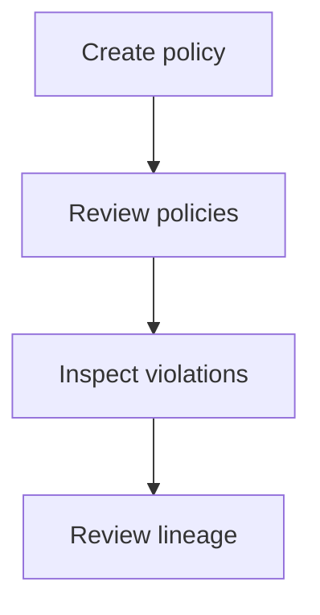
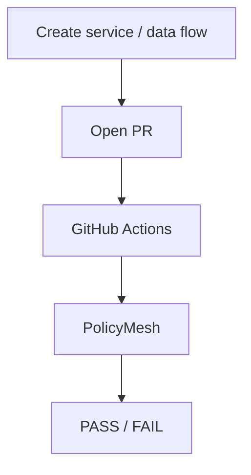

# USER_FLOWS.md

See [AUTHENTICATION.md](./AUTHENTICATION.md) for the underlying role matrix.

## Compliance Officer

Typical interactions: authors and versions policies ([POLICY_DSL.md](./POLICY_DSL.md)), reviews `GET /graph/validate` violations, approves/rejects AI classifications, audits lineage for a specific policy or time range.

## Engineer

Typical interactions: registers `ServiceNode`s and `DataFlowEdge`s, opens pull requests that trigger the CI check ([CI_INTEGRATION.md](./CI_INTEGRATION.md)), fixes violations and re-runs checks, uses the Runtime Simulator to test a flow before shipping.

## Admin

Manages users and roles, has full access across policies/services/graph/lineage, deactivates stale policies or services.

## Viewer

Read-only access to the dashboard, graph, and lineage — cannot create or modify policies, services, or data flows (see role matrix in [AUTHENTICATION.md](./AUTHENTICATION.md)).
