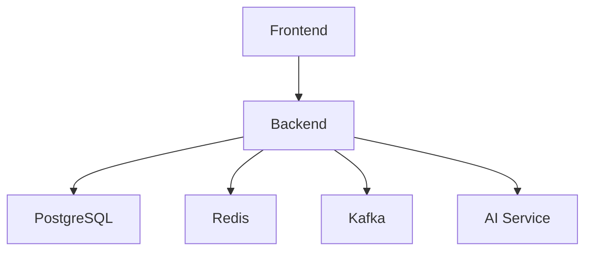

# PolicyMesh infrastructure

This directory provides the repeatable **local-development** runtime for PolicyMesh. It is deliberately not a production platform: it runs one PostgreSQL instance, one Redis instance, one KRaft Kafka broker, and the existing AI service container. The Spring Boot backend and frontend are not included because this repository has no Dockerfile for either component.

## Architecture



Host clients use `localhost:port`; one container reaches another by its Compose service name, such as `postgres:5432`, `redis:6379`, `kafka:9092`, `ai-service:8000`, and eventually `backend:8080`. `localhost` inside a container is that container, never another service.

## Prerequisites and quick start

Install Docker Desktop with Docker Compose v2. From this directory:

```bash
bash scripts/start.sh
# Windows PowerShell
.\scripts\start.ps1
```

The start script copies `env/.env.example` to the ignored `env/.env` on first use. Those values are **DEVELOPMENT ONLY**. Review and replace the password before sharing an environment. To run Compose directly, first create that file (`cp env/.env.example env/.env` or `Copy-Item env/.env.example env/.env`), then run:

```bash
docker compose --env-file env/.env -f compose/docker-compose.yml up -d --build
```

## Services and ports

| Service | Host port | Internal address | Status in this repository |
| --- | ---: | --- | --- |
| Frontend | 5173 | `frontend:5173` | integration point only |
| Backend | 8080 | `backend:8080` | integration point only |
| AI service | 8000 | `ai-service:8000` | included |
| PostgreSQL | 5432 | `postgres:5432` | included |
| Redis | 6379 | `redis:6379` | included |
| Kafka | 9092 | `kafka:9092` | included |

Kafka exposes a host listener at `localhost:9092` and an in-network listener at `kafka:9092`; this dual-listener distinction is intentional.

## Compose modes

- Default: `bash scripts/start.sh` — infrastructure plus the existing AI service.
- Development: `bash scripts/start.sh dev` — AI service source is mounted and Uvicorn reload is enabled.
- Demo: `bash scripts/start.sh demo` — uses deterministic mock AI classification for repeatable demos.

The demo mode cannot launch frontend/backend until those source directories own Dockerfiles. It still starts every runnable component and does not invent application containers. Once Dockerfiles exist, add the services to the relevant Compose overlay using `postgres`, `redis`, `kafka`, and `ai-service` service names.

Stop without deleting data:

```bash
bash scripts/stop.sh
# .\scripts\stop.ps1
```

Destructive local reset (deletes PostgreSQL, Redis, and Kafka volumes):

```bash
bash scripts/reset.sh --confirm
# .\scripts\reset.ps1 -Confirm
```

## Health and demo data

```bash
bash scripts/health-check.sh
bash scripts/seed-demo.sh
```

Health checks execute real database, Redis, Kafka, and AI requests; they report backend/frontend as not configured instead of declaring running containers healthy. `seed-demo` starts demo mode but performs no fake HTTP call: a backend demo-seed endpoint has not been implemented. Add that authenticated endpoint contract, then wire it into the script after the backend health check.

## Data ownership and failure behavior

PostgreSQL is provisioned by infrastructure, but Spring Boot owns its application schema and migrations (`User`, `Policy`, `ServiceNode`, `DataFlowEdge`, `Decision`, `LineageRecord`, `CIScan`, and `AIClassification`). The init script only enables `pgcrypto`; it does not compete with JPA/Hibernate/Flyway.

PostgreSQL is the source of truth. Redis is only a compiled-policy/hot-lookup/optional-decision cache; the backend should fall back to PostgreSQL if Redis is unavailable. Kafka transports asynchronous events and must not make synchronous policy decisions fail. AI classification is optional; core enforcement must continue if the AI service is unavailable.

See [Kafka topics](kafka/topics.md), [Redis keys](redis/key-schema.md), and [PostgreSQL ownership](postgres/schema.md). The CI checker remains a command-line tool invoked locally or by GitHub Actions—not a long-running Compose service.

## Kubernetes and service mesh

`kubernetes/` supplies non-production-ready deployment templates for backend and AI service plus configuration examples. Use managed PostgreSQL/Redis/Kafka or appropriate operators/StatefulSets in production. `istio/` records the future service-mesh model only; Istio is not required locally.

## Troubleshooting

For port collisions, stop the local process or change the relevant `*_PORT`/`KAFKA_HOST_PORT` value in `env/.env`. For an unhealthy service, use:

```bash
docker compose --env-file env/.env -f compose/docker-compose.yml ps
docker compose --env-file env/.env -f compose/docker-compose.yml logs postgres redis kafka ai-service
docker network ls
docker volume ls
```

- Database unhealthy: inspect `postgres` logs and credentials; reset only when local data may be discarded.
- Kafka not ready: it can take longer on first startup while KRaft formats its volume; inspect Kafka logs and wait for the health check.
- Backend connections: configure container values as `postgres:5432`, `redis:6379`, `kafka:9092`, and `http://ai-service:8000`, never `localhost`.
- Frontend connections: browser code should call host `http://localhost:8080`; a frontend container should call `http://backend:8080` only through an internal proxy/server configuration.

## Local versus future production

Local/hackathon: Docker Compose, one database, Redis, Kafka broker, and local/mock AI. Future production: managed PostgreSQL, Redis cluster, Kafka cluster, Kubernetes, multi-region resilience, object/WORM audit storage, and optionally a service mesh. Do not treat this Compose stack or `change-me` credentials as production configuration.
